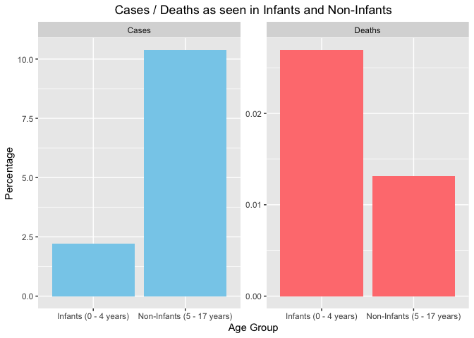
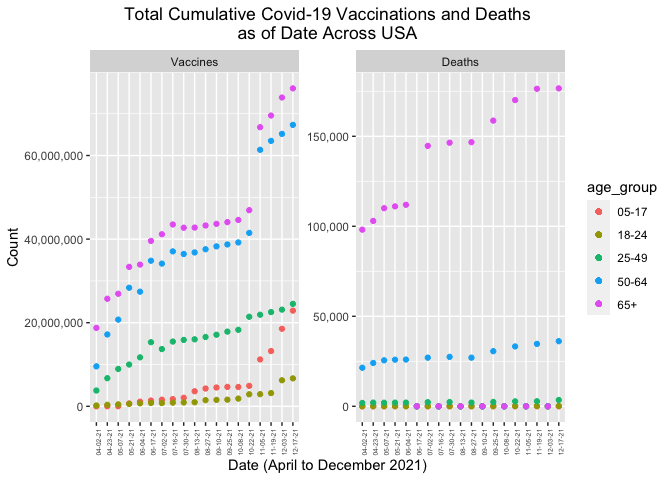
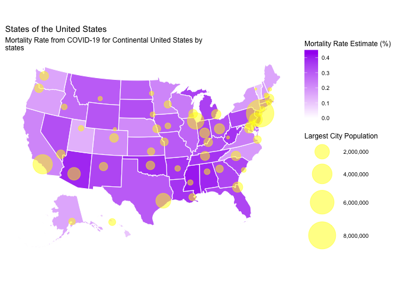
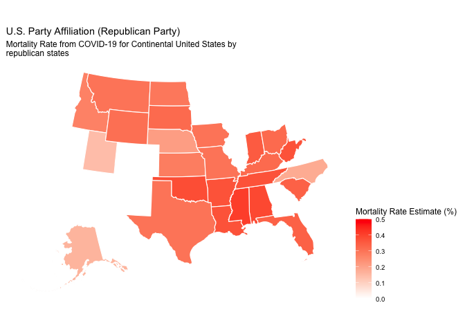
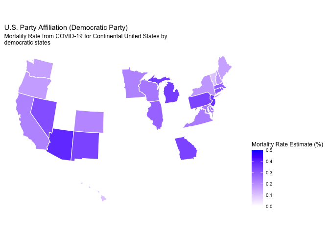

STAT 3355: Analysis of COVID-19 Confirmed Cases, Deaths, and
Vaccinations in the USA
================
Jake LeeWhitney HumeckyAnn Biju

``` r
# Plot 1: Infant vs Non-infant
# Initial cleaning
# reading in the raw data
raw_data_url = "https://raw.githubusercontent.com/govex/COVID-19/master/data_tables/demographic_data/demographics_by_state_raw.csv"

library(janitor)
```

    ## 
    ## Attaching package: 'janitor'

    ## The following objects are masked from 'package:stats':
    ## 
    ##     chisq.test, fisher.test

``` r
library(dplyr)
```

    ## 
    ## Attaching package: 'dplyr'

    ## The following objects are masked from 'package:stats':
    ## 
    ##     filter, lag

    ## The following objects are masked from 'package:base':
    ## 
    ##     intersect, setdiff, setequal, union

``` r
library(ggplot2)
library(readr)
library(wesanderson)
library(UsingR)
```

    ## Loading required package: MASS

    ## 
    ## Attaching package: 'MASS'

    ## The following object is masked from 'package:dplyr':
    ## 
    ##     select

    ## Loading required package: HistData

    ## Loading required package: Hmisc

    ## 
    ## Attaching package: 'Hmisc'

    ## The following objects are masked from 'package:dplyr':
    ## 
    ##     src, summarize

    ## The following objects are masked from 'package:base':
    ## 
    ##     format.pval, units

``` r
library("scales")
```

    ## 
    ## Attaching package: 'scales'

    ## The following object is masked from 'package:readr':
    ## 
    ##     col_factor

``` r
library(data.table)
```

    ## 
    ## Attaching package: 'data.table'

    ## The following objects are masked from 'package:dplyr':
    ## 
    ##     between, first, last

``` r
library(maptools)
```

    ## Loading required package: sp

    ## The legacy packages maptools, rgdal, and rgeos, underpinning the sp package,
    ## which was just loaded, will retire in October 2023.
    ## Please refer to R-spatial evolution reports for details, especially
    ## https://r-spatial.org/r/2023/05/15/evolution4.html.
    ## It may be desirable to make the sf package available;
    ## package maintainers should consider adding sf to Suggests:.
    ## The sp package is now running under evolution status 2
    ##      (status 2 uses the sf package in place of rgdal)

    ## Please note that 'maptools' will be retired during October 2023,
    ## plan transition at your earliest convenience (see
    ## https://r-spatial.org/r/2023/05/15/evolution4.html and earlier blogs
    ## for guidance);some functionality will be moved to 'sp'.
    ##  Checking rgeos availability: FALSE

    ## 
    ## Attaching package: 'maptools'

    ## The following object is masked from 'package:Hmisc':
    ## 
    ##     label

``` r
library(rgdal)
```

    ## Please note that rgdal will be retired during October 2023,
    ## plan transition to sf/stars/terra functions using GDAL and PROJ
    ## at your earliest convenience.
    ## See https://r-spatial.org/r/2023/05/15/evolution4.html and https://github.com/r-spatial/evolution
    ## rgdal: version: 1.6-7, (SVN revision 1203)
    ## Geospatial Data Abstraction Library extensions to R successfully loaded
    ## Loaded GDAL runtime: GDAL 3.5.3, released 2022/10/21
    ## Path to GDAL shared files: /Library/Frameworks/R.framework/Versions/4.2-arm64/Resources/library/rgdal/gdal
    ##  GDAL does not use iconv for recoding strings.
    ## GDAL binary built with GEOS: TRUE 
    ## Loaded PROJ runtime: Rel. 9.1.0, September 1st, 2022, [PJ_VERSION: 910]
    ## Path to PROJ shared files: /Library/Frameworks/R.framework/Versions/4.2-arm64/Resources/library/rgdal/proj
    ## PROJ CDN enabled: FALSE
    ## Linking to sp version:1.6-1
    ## To mute warnings of possible GDAL/OSR exportToProj4() degradation,
    ## use options("rgdal_show_exportToProj4_warnings"="none") before loading sp or rgdal.

``` r
# cleaning raw_demo_data
raw_demo_data <- read.csv(url(raw_data_url))
raw_demo_data2 <- clean_names(raw_demo_data)

#removes all rows and cols that are only composed of NA values
raw_demo_data3 <- remove_empty(raw_demo_data2, which = c("rows", "cols"),
                               quiet = TRUE)

#getting rid of the columns containing 2022 data
rawdata_5 <- subset(raw_demo_data3, select = -c(x1_14_22, x1_28_22, x2_11_22,
                                                x2_25_22, x3_11_22, x3_25_22,
                                                x4_8_22))

percentages_data <- rawdata_5[which(rawdata_5$estimate_type == "rate_percent"),]
all_ages_data <- percentages_data[which(percentages_data$demo_cat_0 == "age"),]
confirmed_data <- all_ages_data[which(all_ages_data$metric == "confirmed"),]

# Infants' data

# INFANTS data (ages 0-4)

infants_data <- confirmed_data[which(confirmed_data$demo_cat_1 == "0_4"),]

# infants data - deaths
infants_data_deaths <- infants_data[which(infants_data$category == "Deaths"),]

#removing NA columns
infants_data_deaths <- infants_data_deaths[, -c(12, 14, 16, 18, 20, 22, 24)]

# infants data - cases
infants_data_cases <- infants_data[which(infants_data$category == "Cases"),]

#removing NA columns
infants_data_cases <- infants_data_cases[, -c(12, 14, 16, 18, 20, 22, 24)]

# Non-Infants' data

#NON_INFANTS DATA
non_infants_data <- confirmed_data[which(confirmed_data$demo_cat_1 == "5_17"),]

# non-infants data - deaths
non_infants_deaths <- non_infants_data[which(
  non_infants_data$category == "Deaths"),]

# non-infants data - cases
non_infants_cases <- non_infants_data[which(
  non_infants_data$category == "Cases"),]

# Calculating the means of infant cases & deaths and non-infant cases & deaths

infant_cases_avg <- colMeans(infants_data_cases[,7:18], na.rm = TRUE)
infant_case <- mean(infant_cases_avg)

infant_death_avg <- colMeans(infants_data_deaths[,7:18], na.rm = TRUE)
infant_death <- mean(infant_death_avg)

non_infant_cases_avg <- colMeans(non_infants_cases[,7:18], na.rm = TRUE)
non_infant_case <- mean(non_infant_cases_avg, na.rm = TRUE)

non_infant_death_avg <- colMeans(non_infants_deaths[,7:18], na.rm = TRUE)
non_infant_death <- mean(non_infant_death_avg, na.rm = TRUE)

# Data frame with the averages for infant cases/deaths and non-infant cases/deaths

final_data <- data.frame(matrix(ncol = 2, nrow = 4))
final_data$percentage <- c(infant_case, infant_death, non_infant_case,
                           non_infant_death)
final_data$category <- c("Cases", "Deaths", "Cases", "Deaths")
final_data$age <- c("Infants (0 - 4 years)", "Infants (0 - 4 years)",
                    "Non-Infants (5 - 17 years)", "Non-Infants (5 - 17 years)")
final_data <- final_data[, -c(1, 2)]

# Infant & Non-Infant plot

ggplot(data = final_data) +
  geom_bar(aes(x = age, y = percentage, fill = category), stat = "identity",
           position = position_dodge()) +
  facet_wrap(~category, scales="free_y") +
  scale_fill_manual(values = c("#87CEEB", "#FF7F7F")) +
  labs(title = "Cases / Deaths as seen in Infants and Non-Infants",
       x = "Age Group", y = "Percentage")  +
  theme(legend.position = "none", plot.title = element_text(hjust = 0.5))
```

<!-- -->

``` r
# Plot 2: Vaccination and Mortality Totals by Age Group

raw_demo_data <- read.csv("demographics_by_state_raw.csv")

# getting rid of the columns containing 2022 data
rawdata_5 <- raw_demo_data[, 1:25]

# Obtain rows for total, cumulative number of cases, vaccines,
# and cases by age groups

newdata <- rawdata_5[which(rawdata_5$Estimate_type == "total_cumulative"), ]

age_cumulative <- newdata[which(newdata$Demo_cat_0 == "age"), ]
age_cumulative <- newdata[which(newdata$Category == "Deaths" |
                                  newdata$Category == "Vaccines"), ]
age_cumulative[is.na(age_cumulative)] <- 0

age_cumulative <- age_cumulative[which(
  age_cumulative$Demo_cat_1 == "65_older" |
    age_cumulative$Demo_cat_1 == "65_74" |
    age_cumulative$Demo_cat_1 == "75_older" |
    age_cumulative$Demo_cat_1 == "65_69" |
    age_cumulative$Demo_cat_1 == "70_74" |
    age_cumulative$Demo_cat_1 == "50_64" |
    age_cumulative$Demo_cat_1 == "55_64" |
    age_cumulative$Demo_cat_1 == "25_49" |
    age_cumulative$Demo_cat_1 == "30_49" |
    age_cumulative$Demo_cat_1 == "25_34" |
    age_cumulative$Demo_cat_1 == "35_44" |
    age_cumulative$Demo_cat_1 == "18_25" |
    age_cumulative$Demo_cat_1 == "18_24" |
    age_cumulative$Demo_cat_1 == "5_17" |
    age_cumulative$Demo_cat_1 == "5_11" |
    age_cumulative$Demo_cat_1 == "12_17" |
    age_cumulative$Demo_cat_1 == "11_17"), ]

# Break up age groups
age_cumulative$Demo_cat_1[which(
  age_cumulative$Demo_cat_1 == "65_older" |
    age_cumulative$Demo_cat_1 == "65_74" |
    age_cumulative$Demo_cat_1 == "75_older" |
    age_cumulative$Demo_cat_1 == "65_69" |
    age_cumulative$Demo_cat_1 == "70_74")] <- "65+"

age_cumulative$Demo_cat_1[which(
  age_cumulative$Demo_cat_1 == "50_64" |
    age_cumulative$Demo_cat_1 == "55_64")] <- "50-64"

age_cumulative$Demo_cat_1[which(
  age_cumulative$Demo_cat_1 == "25_49" |
    age_cumulative$Demo_cat_1 == "30_49" |
    age_cumulative$Demo_cat_1 == "25_34" |
    age_cumulative$Demo_cat_1 == "35_44")] <- "25-49"

age_cumulative$Demo_cat_1[which(
  age_cumulative$Demo_cat_1 == "18_25" |
    age_cumulative$Demo_cat_1 == "18_29" |
    age_cumulative$Demo_cat_1 == "18_24")] <- "18-24"

age_cumulative$Demo_cat_1[which(
  age_cumulative$Demo_cat_1 == "5_17" |
    age_cumulative$Demo_cat_1 == "5_11" |
    age_cumulative$Demo_cat_1 == "12_17" |
    age_cumulative$Demo_cat_1 == "11_17")] <- "5-17"

# vax by age
vax <- age_cumulative[which(age_cumulative$Category == "Vaccines"), ]

vax_65 <- vax[which(vax$Demo_cat_1 == "65+"), ]
vax_50 <- vax[which(vax$Demo_cat_1 == "50-64"), ]
vax_25 <- vax[which(vax$Demo_cat_1 == "25-49"), ]
vax_18 <- vax[which(vax$Demo_cat_1 == "18-24"), ]
vax_5 <- vax[which(vax$Demo_cat_1 == "5-17"), ]

sums_vax65 <- colSums(vax_65[, 7:25])
sums_vax50 <- colSums(vax_50[, 7:25])
sums_vax25 <- colSums(vax_25[, 7:25])
sums_vax18 <- colSums(vax_18[, 7:25])
sums_vax5 <- colSums(vax_5[, 7:25])

#Deaths by age

deaths <-
  age_cumulative[which(age_cumulative$Category == "Deaths"), ]

deaths_65 <- deaths[which(deaths$Demo_cat_1 == "65+"), ]
deaths_50 <- deaths[which(deaths$Demo_cat_1 == "50-64"), ]
deaths_25 <- deaths[which(deaths$Demo_cat_1 == "25-49"), ]
deaths_18 <- deaths[which(deaths$Demo_cat_1 == "18-24"), ]
deaths_5 <- deaths[which(deaths$Demo_cat_1 == "5-17"), ]

sums_deaths65 <- colSums(deaths_65[, 7:25])
sums_deaths50 <- colSums(deaths_50[, 7:25])
sums_deaths25 <- colSums(deaths_25[, 7:25])
sums_deaths18 <- colSums(deaths_18[, 7:25])
sums_deaths5 <- colSums(deaths_5[, 7:25])

# Add variable "Distinction" to facet plot by deaths and vaccines

distinction <- c("Vaccines", "Vaccines", "Vaccines", "Vaccines", "Vaccines",
                 "Deaths", "Deaths", "Deaths", "Deaths", "Deaths")
distinction <- factor(distinction, ordered = FALSE, levels = c("Vaccines",
                                                               "Deaths"))

# Dates and age group labels for plot

dates <- c("04-02-21", "04-23-21", "05-07-21", "05-21-21", "06-04-21",
           "06-17-21", "07-02-21", "07-16-21", "07-30-21", "08-13-21",
           "08-27-21", "09-10-21", "09-25-21", "10-08-21", "10-22-21",
           "11-05-21", "11-19-21", "12-03-21", "12-17-21")
dates <- factor(dates, ordered = TRUE, levels = dates)

age_group <- c("05-17", "18-24", "25-49", "50-64", "65+", "05-17", "18-24",
               "25-49", "50-64", "65+")

# Separating columns by date

x4.2.21 <- c(sums_vax5[1], sums_vax18[1], sums_vax25[1], sums_vax50[1],
             sums_vax65[1], sums_deaths5[1], sums_deaths18[1], sums_deaths25[1],
             sums_deaths50[1], sums_deaths65[1])
x4.23.21 <- c(sums_vax5[2], sums_vax18[2], sums_vax25[2], sums_vax50[2],
              sums_vax65[2], sums_deaths5[2], sums_deaths18[2],
              sums_deaths25[2], sums_deaths50[2], sums_deaths65[2])
x5.7.21 <- c(sums_vax5[3], sums_vax18[3], sums_vax25[3], sums_vax50[3],
             sums_vax65[3], sums_deaths5[3], sums_deaths18[3], sums_deaths25[3],
             sums_deaths50[3], sums_deaths65[3])
x5.21.21 <- c(sums_vax5[4], sums_vax18[4], sums_vax25[4], sums_vax50[4],
              sums_vax65[4], sums_deaths5[4], sums_deaths18[4],
              sums_deaths25[4], sums_deaths50[4], sums_deaths65[4])
x6.4.21 <- c(sums_vax5[5], sums_vax18[5], sums_vax25[5], sums_vax50[5],
             sums_vax65[5], sums_deaths5[5], sums_deaths18[5], sums_deaths25[5],
             sums_deaths50[5], sums_deaths65[5])
x6.17.21<- c(sums_vax5[6], sums_vax18[6], sums_vax25[6], sums_vax50[6],
             sums_vax65[6], sums_deaths5[6], sums_deaths18[6], sums_deaths25[6],
             sums_deaths50[6], sums_deaths65[6])
x7.2.21 <- c(sums_vax5[7], sums_vax18[7], sums_vax25[7], sums_vax50[7],
             sums_vax65[7], sums_deaths5[7], sums_deaths18[7], sums_deaths25[7],
             sums_deaths50[7], sums_deaths65[7])
x7.16.21 <- c(sums_vax5[8], sums_vax18[8], sums_vax25[8], sums_vax50[8],
              sums_vax65[8], sums_deaths5[8], sums_deaths18[8],
              sums_deaths25[8], sums_deaths50[8], sums_deaths65[8])
x7.30.21 <- c(sums_vax5[9], sums_vax18[9], sums_vax25[9], sums_vax50[9],
              sums_vax65[9], sums_deaths5[9], sums_deaths18[9],
              sums_deaths25[9], sums_deaths50[9], sums_deaths65[9])
x8.13.21 <- c(sums_vax5[10], sums_vax18[10], sums_vax25[10], sums_vax50[10],
              sums_vax65[10], sums_deaths5[10], sums_deaths18[10],
              sums_deaths25[10], sums_deaths50[10], sums_deaths65[10])
x8.27.21 <- c(sums_vax5[11], sums_vax18[11], sums_vax25[11], sums_vax50[11],
              sums_vax65[11], sums_deaths5[11], sums_deaths18[11],
              sums_deaths25[11], sums_deaths50[11], sums_deaths65[11])
x9.10.21 <- c(sums_vax5[12], sums_vax18[12], sums_vax25[12], sums_vax50[12],
              sums_vax65[12],
              sums_deaths5[12], sums_deaths18[12], sums_deaths25[12],
              sums_deaths50[12], sums_deaths65[12])
x9.25.21 <- c(sums_vax5[13], sums_vax18[13], sums_vax25[13], sums_vax50[13],
              sums_vax65[13],
              sums_deaths5[13], sums_deaths18[13], sums_deaths25[13],
              sums_deaths50[13], sums_deaths65[13])
x10.8.21 <- c(sums_vax5[14], sums_vax18[14], sums_vax25[14], sums_vax50[14],
              sums_vax65[14],
              sums_deaths5[14], sums_deaths18[14], sums_deaths25[14],
              sums_deaths50[14], sums_deaths65[14])
x10.22.21 <- c(sums_vax5[15], sums_vax18[15], sums_vax25[15], sums_vax50[15],
               sums_vax65[15],
               sums_deaths5[15], sums_deaths18[15], sums_deaths25[15],
               sums_deaths50[15], sums_deaths65[15])
x11.5.21 <- c(sums_vax5[16], sums_vax18[16], sums_vax25[16], sums_vax50[16],
              sums_vax65[16],
              sums_deaths5[16], sums_deaths18[16], sums_deaths25[16],
              sums_deaths50[16], sums_deaths65[16])
x11.19.21 <- c(sums_vax5[17], sums_vax18[17], sums_vax25[17], sums_vax50[17],
               sums_vax65[17],
               sums_deaths5[17], sums_deaths18[17], sums_deaths25[17],
               sums_deaths50[17], sums_deaths65[17])
x12.3.21 <- c(sums_vax5[18], sums_vax18[18], sums_vax25[18], sums_vax50[18],
              sums_vax65[18],
              sums_deaths5[18], sums_deaths18[18], sums_deaths25[18],
              sums_deaths50[18], sums_deaths65[18])
x12.17.21 <- c(sums_vax5[19], sums_vax18[19], sums_vax25[19], sums_vax50[19],
               sums_vax65[19],
               sums_deaths5[19], sums_deaths18[19], sums_deaths25[19],
               sums_deaths50[19], sums_deaths65[19])

# New data frame for sums by date, age group, and vaccine or death toll

end_data <- data.frame(age_group, distinction, x4.2.21, x4.23.21, x5.7.21,
                       x5.21.21, x6.4.21, x6.17.21, x7.2.21, x7.16.21, x7.30.21, x8.13.21,
                       x8.27.21, x9.10.21, x9.25.21, x10.8.21, x10.22.21, x11.5.21,
                       x11.19.21, x12.3.21, x12.17.21)

end_data[is.na(end_data)] <- 0

# Plot

ggplot(data = end_data, mapping = aes(color = age_group)) +
  geom_point(mapping = aes(x = dates[1], y = end_data[1:10, 3])) +
  geom_point(mapping = aes(x = dates[2], y = end_data[1:10, 4])) +
  geom_point(mapping = aes(x = dates[3], y = end_data[1:10, 5])) +
  geom_point(mapping = aes(x = dates[4], y = end_data[1:10, 6])) +
  geom_point(mapping = aes(x = dates[5], y = end_data[1:10, 7])) +
  geom_point(mapping = aes(x = dates[6], y = end_data[1:10, 8])) +
  geom_point(mapping = aes(x = dates[7], y = end_data[1:10, 9])) +
  geom_point(mapping = aes(x = dates[8], y = end_data[1:10, 10])) +
  geom_point(mapping = aes(x = dates[9], y = end_data[1:10, 11])) +
  geom_point(mapping = aes(x = dates[10], y = end_data[1:10, 12])) +
  geom_point(mapping = aes(x = dates[11], y = end_data[1:10, 13])) +
  geom_point(mapping = aes(x = dates[12], y = end_data[1:10, 14])) +
  geom_point(mapping = aes(x = dates[13], y = end_data[1:10, 15])) +
  geom_point(mapping = aes(x = dates[14], y = end_data[1:10, 16])) +
  geom_point(mapping = aes(x = dates[15], y = end_data[1:10, 17])) +
  geom_point(mapping = aes(x = dates[16], y = end_data[1:10, 18])) +
  geom_point(mapping = aes(x = dates[17], y = end_data[1:10, 19])) +
  geom_point(mapping = aes(x = dates[18], y = end_data[1:10, 20])) +
  geom_point(mapping = aes(x = dates[19], y = end_data[1:10, 21])) +
  theme(axis.text.x = element_text(angle = 90, size = 5, hjust = 1),
        plot.title = element_text(hjust = .5)) +
  labs(x = "Date (April to December 2021)",
       y = "Count",
       title = "Total Cumulative Covid-19 Vaccinations and Deaths
as of Date Across USA")+
  facet_wrap(vars(end_data[,2]), scales = "free_y")  +
  scale_y_continuous(labels = comma)
```

<!-- -->

``` r
# Plots 3 and 4: US Politcal Maps vs Conf. Cases

#store the initial-raw datasheet for data-cleaning
my_data <- fread("RAW_us_deaths.csv")

#remove unnecessary & unknown variables
dplyr::select(my_data, -c(iso2, iso3, Country_Region, Lat, Long_, Combined_Key,
                          UID, FIPS, code3, Admin2))
```

    ##       Province_State Population 1/22/20 1/23/20 1/24/20 1/25/20 1/26/20 1/27/20
    ##    1:        Alabama      55869       0       0       0       0       0       0
    ##    2:        Alabama     223234       0       0       0       0       0       0
    ##    3:        Alabama      24686       0       0       0       0       0       0
    ##    4:        Alabama      22394       0       0       0       0       0       0
    ##    5:        Alabama      57826       0       0       0       0       0       0
    ##   ---                                                                          
    ## 3338:        Wyoming      23464       0       0       0       0       0       0
    ## 3339:        Wyoming      20226       0       0       0       0       0       0
    ## 3340:        Wyoming          0       0       0       0       0       0       0
    ## 3341:        Wyoming       7805       0       0       0       0       0       0
    ## 3342:        Wyoming       6927       0       0       0       0       0       0
    ##       1/28/20 1/29/20 1/30/20 1/31/20 2/1/20 2/2/20 2/3/20 2/4/20 2/5/20 2/6/20
    ##    1:       0       0       0       0      0      0      0      0      0      0
    ##    2:       0       0       0       0      0      0      0      0      0      0
    ##    3:       0       0       0       0      0      0      0      0      0      0
    ##    4:       0       0       0       0      0      0      0      0      0      0
    ##    5:       0       0       0       0      0      0      0      0      0      0
    ##   ---                                                                          
    ## 3338:       0       0       0       0      0      0      0      0      0      0
    ## 3339:       0       0       0       0      0      0      0      0      0      0
    ## 3340:       0       0       0       0      0      0      0      0      0      0
    ## 3341:       0       0       0       0      0      0      0      0      0      0
    ## 3342:       0       0       0       0      0      0      0      0      0      0
    ##       2/7/20 2/8/20 2/9/20 2/10/20 2/11/20 2/12/20 2/13/20 2/14/20 2/15/20
    ##    1:      0      0      0       0       0       0       0       0       0
    ##    2:      0      0      0       0       0       0       0       0       0
    ##    3:      0      0      0       0       0       0       0       0       0
    ##    4:      0      0      0       0       0       0       0       0       0
    ##    5:      0      0      0       0       0       0       0       0       0
    ##   ---                                                                     
    ## 3338:      0      0      0       0       0       0       0       0       0
    ## 3339:      0      0      0       0       0       0       0       0       0
    ## 3340:      0      0      0       0       0       0       0       0       0
    ## 3341:      0      0      0       0       0       0       0       0       0
    ## 3342:      0      0      0       0       0       0       0       0       0
    ##       2/16/20 2/17/20 2/18/20 2/19/20 2/20/20 2/21/20 2/22/20 2/23/20 2/24/20
    ##    1:       0       0       0       0       0       0       0       0       0
    ##    2:       0       0       0       0       0       0       0       0       0
    ##    3:       0       0       0       0       0       0       0       0       0
    ##    4:       0       0       0       0       0       0       0       0       0
    ##    5:       0       0       0       0       0       0       0       0       0
    ##   ---                                                                        
    ## 3338:       0       0       0       0       0       0       0       0       0
    ## 3339:       0       0       0       0       0       0       0       0       0
    ## 3340:       0       0       0       0       0       0       0       0       0
    ## 3341:       0       0       0       0       0       0       0       0       0
    ## 3342:       0       0       0       0       0       0       0       0       0
    ##       2/25/20 2/26/20 2/27/20 2/28/20 2/29/20 3/1/20 3/2/20 3/3/20 3/4/20
    ##    1:       0       0       0       0       0      0      0      0      0
    ##    2:       0       0       0       0       0      0      0      0      0
    ##    3:       0       0       0       0       0      0      0      0      0
    ##    4:       0       0       0       0       0      0      0      0      0
    ##    5:       0       0       0       0       0      0      0      0      0
    ##   ---                                                                    
    ## 3338:       0       0       0       0       0      0      0      0      0
    ## 3339:       0       0       0       0       0      0      0      0      0
    ## 3340:       0       0       0       0       0      0      0      0      0
    ## 3341:       0       0       0       0       0      0      0      0      0
    ## 3342:       0       0       0       0       0      0      0      0      0
    ##       3/5/20 3/6/20 3/7/20 3/8/20 3/9/20 3/10/20 3/11/20 3/12/20 3/13/20
    ##    1:      0      0      0      0      0       0       0       0       0
    ##    2:      0      0      0      0      0       0       0       0       0
    ##    3:      0      0      0      0      0       0       0       0       0
    ##    4:      0      0      0      0      0       0       0       0       0
    ##    5:      0      0      0      0      0       0       0       0       0
    ##   ---                                                                   
    ## 3338:      0      0      0      0      0       0       0       0       0
    ## 3339:      0      0      0      0      0       0       0       0       0
    ## 3340:      0      0      0      0      0       0       0       0       0
    ## 3341:      0      0      0      0      0       0       0       0       0
    ## 3342:      0      0      0      0      0       0       0       0       0
    ##       3/14/20 3/15/20 3/16/20 3/17/20 3/18/20 3/19/20 3/20/20 3/21/20 3/22/20
    ##    1:       0       0       0       0       0       0       0       0       0
    ##    2:       0       0       0       0       0       0       0       0       0
    ##    3:       0       0       0       0       0       0       0       0       0
    ##    4:       0       0       0       0       0       0       0       0       0
    ##    5:       0       0       0       0       0       0       0       0       0
    ##   ---                                                                        
    ## 3338:       0       0       0       0       0       0       0       0       0
    ## 3339:       0       0       0       0       0       0       0       0       0
    ## 3340:       0       0       0       0       0       0       0       0       0
    ## 3341:       0       0       0       0       0       0       0       0       0
    ## 3342:       0       0       0       0       0       0       0       0       0
    ##       3/23/20 3/24/20 3/25/20 3/26/20 3/27/20 3/28/20 3/29/20 3/30/20 3/31/20
    ##    1:       0       0       0       0       0       0       0       0       0
    ##    2:       0       0       0       0       0       0       1       1       1
    ##    3:       0       0       0       0       0       0       0       0       0
    ##    4:       0       0       0       0       0       0       0       0       0
    ##    5:       0       0       0       0       0       0       0       0       0
    ##   ---                                                                        
    ## 3338:       0       0       0       0       0       0       0       0       0
    ## 3339:       0       0       0       0       0       0       0       0       0
    ## 3340:       0       0       0       0       0       0       0       0       0
    ## 3341:       0       0       0       0       0       0       0       0       0
    ## 3342:       0       0       0       0       0       0       0       0       0
    ##       4/1/20 4/2/20 4/3/20 4/4/20 4/5/20 4/6/20 4/7/20 4/8/20 4/9/20 4/10/20
    ##    1:      0      0      0      0      0      0      1      1      1       1
    ##    2:      1      1      1      1      1      1      1      1      1       1
    ##    3:      0      0      0      0      0      0      0      0      0       0
    ##    4:      0      0      0      0      0      0      0      0      0       0
    ##    5:      0      0      0      0      0      0      0      0      0       0
    ##   ---                                                                       
    ## 3338:      0      0      0      0      0      0      0      0      0       0
    ## 3339:      0      0      0      0      0      0      0      0      0       0
    ## 3340:      0      0      0      0      0      0      0      0      0       0
    ## 3341:      0      0      0      0      0      0      0      0      0       0
    ## 3342:      0      0      0      0      0      0      0      0      0       0
    ##       4/11/20 4/12/20 4/13/20 4/14/20 4/15/20 4/16/20 4/17/20 4/18/20 4/19/20
    ##    1:       1       1       1       1       1       1       2       2       2
    ##    2:       1       1       1       2       2       2       2       2       2
    ##    3:       0       0       0       0       0       0       0       0       0
    ##    4:       0       0       0       0       0       0       0       0       0
    ##    5:       0       0       0       0       0       0       0       0       0
    ##   ---                                                                        
    ## 3338:       0       0       0       0       0       0       0       0       0
    ## 3339:       0       0       0       0       0       0       0       0       0
    ## 3340:       0       0       0       0       0       1       1       1       1
    ## 3341:       0       0       0       0       0       0       0       0       0
    ## 3342:       0       0       0       0       0       0       0       0       0
    ##       4/20/20 4/21/20 4/22/20 4/23/20 4/24/20 4/25/20 4/26/20 4/27/20 4/28/20
    ##    1:       1       1       2       2       2       2       2       3       4
    ##    2:       3       3       3       3       3       3       3       3       3
    ##    3:       0       0       0       0       0       0       0       0       0
    ##    4:       0       0       0       0       0       0       0       0       0
    ##    5:       0       0       0       0       0       0       0       0       0
    ##   ---                                                                        
    ## 3338:       0       0       0       0       0       0       0       0       0
    ## 3339:       0       0       0       0       0       0       0       0       0
    ## 3340:       1       1       5       6       6       6       6       6       6
    ## 3341:       0       0       0       0       0       0       0       0       0
    ## 3342:       0       0       0       0       0       0       0       0       0
    ##       4/29/20 4/30/20 5/1/20 5/2/20 5/3/20 5/4/20 5/5/20 5/6/20 5/7/20 5/8/20
    ##    1:       4       4      3      3      3      3      3      3      3      4
    ##    2:       3       3      4      4      4      4      5      5      5      5
    ##    3:       1       1      1      1      1      1      1      1      1      1
    ##    4:       0       0      0      0      0      0      0      0      0      1
    ##    5:       0       0      0      0      0      0      0      0      0      0
    ##   ---                                                                        
    ## 3338:       0       0      0      0      0      0      0      0      0      0
    ## 3339:       0       0      0      0      0      0      0      0      0      0
    ## 3340:       6       6      6      6      6      6      6      6      6      6
    ## 3341:       0       0      0      0      0      0      0      0      0      0
    ## 3342:       0       0      0      0      0      0      0      0      0      0
    ##       5/9/20 5/10/20 5/11/20 5/12/20 5/13/20 5/14/20 5/15/20 5/16/20 5/17/20
    ##    1:      4       4       4       4       4       4       4       4       4
    ##    2:      5       5       6       7       7       8       8       8       8
    ##    3:      1       1       1       1       1       1       1       1       1
    ##    4:      1       1       1       1       1       1       1       1       1
    ##    5:      0       0       0       0       0       0       0       0       1
    ##   ---                                                                       
    ## 3338:      0       0       0       0       0       0       0       0       0
    ## 3339:      0       0       0       0       0       0       0       0       0
    ## 3340:      6       6       6       6       6       6       6       6       7
    ## 3341:      0       0       0       0       0       0       0       0       0
    ## 3342:      0       0       0       0       0       0       0       0       0
    ##       5/18/20 5/19/20 5/20/20 5/21/20 5/22/20 5/23/20 5/24/20 5/25/20 5/26/20
    ##    1:       4       4       3       3       3       3       3       3       3
    ##    2:       8       8       8       8       9       9       9       9       9
    ##    3:       1       1       1       1       1       1       1       1       1
    ##    4:       1       1       1       1       1       1       1       1       1
    ##    5:       1       1       1       1       1       1       1       1       1
    ##   ---                                                                        
    ## 3338:       0       0       0       0       0       0       0       0       0
    ## 3339:       0       0       0       0       0       0       0       0       0
    ## 3340:       9       9      10      11      11      11      11      11      12
    ## 3341:       0       0       0       0       0       0       0       0       0
    ## 3342:       0       0       0       0       0       0       0       0       0
    ##       5/27/20 5/28/20 5/29/20 5/30/20 5/31/20 6/1/20 6/2/20 6/3/20 6/4/20
    ##    1:       3       3       3       4       4      5      5      5      5
    ##    2:       9       9       9       9       9      9      9      9      9
    ##    3:       1       1       1       1       1      1      1      1      1
    ##    4:       1       1       1       1       1      1      1      1      1
    ##    5:       1       1       1       1       1      1      1      1      1
    ##   ---                                                                    
    ## 3338:       0       0       0       0       0      0      0      0      0
    ## 3339:       0       0       0       0       0      0      0      0      0
    ## 3340:      13      14      14      15      15     16     16     16     16
    ## 3341:       0       0       0       0       0      0      0      0      0
    ## 3342:       0       0       0       0       0      0      0      0      0
    ##       6/5/20 6/6/20 6/7/20 6/8/20 6/9/20 6/10/20 6/11/20 6/12/20 6/13/20
    ##    1:      5      5      5      5      5       6       6       6       6
    ##    2:      9      9      9      9      9       9       9       9       9
    ##    3:      1      1      1      1      1       1       1       1       1
    ##    4:      1      1      1      1      1       1       1       1       1
    ##    5:      1      1      1      1      1       1       1       1       1
    ##   ---                                                                   
    ## 3338:      0      0      0      0      0       0       0       0       0
    ## 3339:      0      0      0      0      0       0       0       0       0
    ## 3340:     16     16     16     16     16      17      17      17      17
    ## 3341:      0      0      0      0      0       0       0       0       0
    ## 3342:      0      0      0      0      0       0       0       0       0
    ##       6/14/20 6/15/20 6/16/20 6/17/20 6/18/20 6/19/20 6/20/20 6/21/20 6/22/20
    ##    1:       6       6       6       6       7       7       8       8       8
    ##    2:       9       9       9       9       9       9       9       9       9
    ##    3:       1       1       1       1       1       1       1       1       1
    ##    4:       1       1       1       1       1       1       1       1       1
    ##    5:       1       1       1       1       1       1       1       1       1
    ##   ---                                                                        
    ## 3338:       0       0       0       0       0       0       0       0       0
    ## 3339:       0       0       0       0       0       0       0       0       0
    ## 3340:      17      17      17      17      17      19      19      19      19
    ## 3341:       0       0       0       0       0       0       0       0       0
    ## 3342:       0       0       0       0       0       0       0       0       0
    ##       6/23/20 6/24/20 6/25/20 6/26/20 6/27/20 6/28/20 6/29/20 6/30/20 7/1/20
    ##    1:       8      10      10      10      11      11      11      11     11
    ##    2:       9       9       9       9       9       9       9       9      9
    ##    3:       1       1       1       1       1       1       1       1      1
    ##    4:       1       1       1       1       1       1       1       1      1
    ##    5:       1       1       1       1       1       1       1       1      1
    ##   ---                                                                       
    ## 3338:       0       0       0       0       0       0       0       0      0
    ## 3339:       0       0       0       0       0       0       0       0      0
    ## 3340:      19      19      19      19      19      19      19      19     19
    ## 3341:       0       0       0       0       0       0       0       0      0
    ## 3342:       0       0       0       0       0       0       0       0      0
    ##       7/2/20 7/3/20 7/4/20 7/5/20 7/6/20 7/7/20 7/8/20 7/9/20 7/10/20 7/11/20
    ##    1:     12     12     12     12     12     12     12     13      14      14
    ##    2:      9      9      9      9      9      9      9     10      11      11
    ##    3:      1      2      2      2      2      2      2      2       2       2
    ##    4:      1      1      1      1      1      1      1      1       1       1
    ##    5:      1      1      1      1      1      1      1      1       1       1
    ##   ---                                                                        
    ## 3338:      0      0      0      0      0      0      0      0       0       0
    ## 3339:      0      0      0      0      0      0      0      0       0       0
    ## 3340:     19     19     19     19     19     20     20     20      20      20
    ## 3341:      0      0      0      0      0      0      0      0       0       0
    ## 3342:      0      0      0      0      0      0      0      0       0       0
    ##       7/12/20 7/13/20 7/14/20 7/15/20 7/16/20 7/17/20 7/18/20 7/19/20 7/20/20
    ##    1:      15      15      17      18      19      20      20      20      20
    ##    2:      11      11      11      12      13      13      14      14      14
    ##    3:       2       2       3       3       3       3       3       3       4
    ##    4:       1       1       2       2       2       2       2       2       2
    ##    5:       1       1       1       1       1       1       1       1       1
    ##   ---                                                                        
    ## 3338:       0       0       0       0       0       0       0       0       0
    ## 3339:       0       0       0       0       0       0       0       0       0
    ## 3340:      20      20      21      21      23      23      23      24      23
    ## 3341:       0       0       0       0       0       0       0       0       0
    ## 3342:       0       0       0       0       0       0       0       0       0
    ##       7/21/20 7/22/20 7/23/20 7/24/20 7/25/20 7/26/20 7/27/20 7/28/20 7/29/20
    ##    1:      20      20      20      20      20      20      20      20      20
    ##    2:      15      15      16      17      17      17      17      17      20
    ##    3:       4       4       4       4       4       4       4       4       4
    ##    4:       2       2       2       2       2       2       2       2       2
    ##    5:       1       1       1       1       1       1       1       1       3
    ##   ---                                                                        
    ## 3338:       0       0       0       0       0       0       0       0       0
    ## 3339:       0       0       0       0       0       0       0       0       0
    ## 3340:      24      24      24      24      24      24      24      25      25
    ## 3341:       0       0       0       0       0       0       0       0       0
    ## 3342:       0       0       0       0       0       0       0       0       0
    ##       7/30/20 7/31/20 8/1/20 8/2/20 8/3/20 8/4/20 8/5/20 8/6/20 8/7/20 8/8/20
    ##    1:      20      20     20     20     20     20     21     21     21     21
    ##    2:      20      21     21     22     23     23     23     23     23     24
    ##    3:       5       5      5      5      5      5      5      5      5      5
    ##    4:       2       2      2      3      3      3      4      4      4      5
    ##    5:       3       3      3      3      3      3      3      3      3      4
    ##   ---                                                                        
    ## 3338:       0       0      0      0      0      0      0      0      0      0
    ## 3339:       0       0      0      0      0      0      0      0      0      0
    ## 3340:      25      25     25     25     26     26     26     26     27     27
    ## 3341:       0       0      0      0      0      0      0      0      0      0
    ## 3342:       0       0      0      0      0      0      0      0      0      0
    ##       8/9/20 8/10/20 8/11/20 8/12/20 8/13/20 8/14/20 8/15/20 8/16/20 8/17/20
    ##    1:     21      21      22      22      22      22      22      22      22
    ##    2:     25      25      29      29      29      29      29      29      29
    ##    3:      5       5       6       6       6       6       6       6       6
    ##    4:      5       5       5       5       5       5       5       5       5
    ##    5:      4       4       5       5       5       5       5       5       5
    ##   ---                                                                       
    ## 3338:      0       0       0       0       0       0       0       0       0
    ## 3339:      0       0       0       0       0       0       0       0       0
    ## 3340:     27      27      28      28      29      29      29      29      29
    ## 3341:      0       0       0       0       0       0       0       0       0
    ## 3342:      0       0       0       0       0       0       0       0       0
    ##       8/18/20 8/19/20 8/20/20 8/21/20 8/22/20 8/23/20 8/24/20 8/25/20 8/26/20
    ##    1:      22      22      22      22      22      22      22      22      22
    ##    2:      30      30      31      32      32      32      32      32      33
    ##    3:       6       7       7       7       7       7       7       7       7
    ##    4:       5       5       6       6       6       6       6       6       5
    ##    5:       5       5       5       6       6       6       6       6       7
    ##   ---                                                                        
    ## 3338:       0       0       0       0       0       0       0       0       0
    ## 3339:       0       0       0       0       0       0       0       0       0
    ## 3340:      29      33      33      36      36      36      36      36      36
    ## 3341:       0       0       0       0       0       0       0       0       0
    ## 3342:       0       0       0       0       0       0       0       0       0
    ##       8/27/20 8/28/20 8/29/20 8/30/20 8/31/20 9/1/20 9/2/20 9/3/20 9/4/20
    ##    1:      22      22      22      22      22     23     23     23     23
    ##    2:      34      35      36      36      38     38     38     40     42
    ##    3:       7       7       7       7       7      7      7      7      7
    ##    4:       5       5       6       6       7      7      7      6      6
    ##    5:       7       9       9      10      11     11     11     11     12
    ##   ---                                                                    
    ## 3338:       0       0       0       0       0      0      1      1      1
    ## 3339:       0       0       0       0       0      0      2      2      2
    ## 3340:      36      36      36      36      36     36      0      0      0
    ## 3341:       0       0       0       0       0      0      6      6      6
    ## 3342:       0       0       0       0       0      0      0      0      0
    ##       9/5/20 9/6/20 9/7/20 9/8/20 9/9/20 9/10/20 9/11/20 9/12/20 9/13/20
    ##    1:     23     23     23     23     23      23      23      23      23
    ##    2:     42     42     42     42     42      42      43      43      43
    ##    3:      7      7      7      7      7       7       7       7       7
    ##    4:      6      6      6      6      6       6       6       6       6
    ##    5:     12     12     12     12     12      12      12      13      13
    ##   ---                                                                   
    ## 3338:      1      1      1      1      1       1       1       1       1
    ## 3339:      2      2      2      2      2       2       2       2       2
    ## 3340:      0      0      0      0      0       0       0       0       0
    ## 3341:      6      6      6      6      6       6       6       6       6
    ## 3342:      0      0      0      0      0       0       0       0       0
    ##       9/14/20 9/15/20 9/16/20 9/17/20 9/18/20 9/19/20 9/20/20 9/21/20 9/22/20
    ##    1:      23      23      24      24      24      24      24      24      25
    ##    2:      43      43      47      48      48      49      49      49      49
    ##    3:       7       7       7       7       7       7       7       7       7
    ##    4:       6       6       9       9      10      10      10      10      10
    ##    5:      13      13      13      13      14      14      14      14      14
    ##   ---                                                                        
    ## 3338:       1       1       1       1       1       1       1       1       1
    ## 3339:       2       2       2       2       2       2       2       2       2
    ## 3340:       0       0       4       0       0       0       0       0       0
    ## 3341:       6       6       6       6       6       6       6       6       6
    ## 3342:       0       0       0       0       0       0       0       0       0
    ##       9/23/20 9/24/20 9/25/20 9/26/20 9/27/20 9/28/20 9/29/20 9/30/20 10/1/20
    ##    1:      25      25      25      25      25      25      27      27      28
    ##    2:      49      50      50      50      50      50      50      52      53
    ##    3:       7       7       7       7       7       7       7       7       7
    ##    4:      10      10      10      10      10      10      10      11      10
    ##    5:      15      15      15      15      15      15      15      15      15
    ##   ---                                                                        
    ## 3338:       1       1       1       1       1       1       1       1       1
    ## 3339:       2       2       2       2       2       2       2       2       2
    ## 3340:       0       0       0       0       0       0       0       0       0
    ## 3341:       6       6       6       6       6       6       6       6       6
    ## 3342:       0       0       0       0       0       0       0       0       0
    ##       10/2/20 10/3/20 10/4/20 10/5/20 10/6/20 10/7/20 10/8/20 10/9/20 10/10/20
    ##    1:      27      27      27      27      27      27      28      28       28
    ##    2:      53      53      53      53      55      56      64      64       65
    ##    3:       7       7       7       7       7       7       9       9        9
    ##    4:      10      10      10      10      10      10      12      12       12
    ##    5:      15      15      15      15      15      16      16      16       16
    ##   ---                                                                         
    ## 3338:       1       1       1       1       1       1       1       1        1
    ## 3339:       2       2       2       2       2       2       2       2        2
    ## 3340:       0       0       0       0       0       0       1       1        1
    ## 3341:       6       6       6       6       6       6       6       6        6
    ## 3342:       0       0       0       0       0       0       0       0        0
    ##       10/11/20 10/12/20 10/13/20 10/14/20 10/15/20 10/16/20 10/17/20 10/18/20
    ##    1:       28       28       28       28       28       28       28       28
    ##    2:       65       65       65       66       66       67       67       67
    ##    3:        9        9        9        9        9        9        9        9
    ##    4:       12       12       12       13       13       13       13       13
    ##    5:       16       16       16       23       23       23       23       23
    ##   ---                                                                        
    ## 3338:        1        1        1        1        1        1        1        1
    ## 3339:        2        2        2        2        2        2        2        2
    ## 3340:        1        0        0        0        0        0        0        0
    ## 3341:        6        6        7        7        7        7        7        7
    ## 3342:        0        0        0        0        0        0        0        0
    ##       10/19/20 10/20/20 10/21/20 10/22/20 10/23/20 10/24/20 10/25/20 10/26/20
    ##    1:       28       29       30       30       30       31       31       31
    ##    2:       67       69       69       69       69       69       69       69
    ##    3:        9        9        9        9        9        9        9        9
    ##    4:       13       14       14       14       14       14       14       14
    ##    5:       23       24       25       25       25       25       25       25
    ##   ---                                                                        
    ## 3338:        1        1        1        1        1        1        1        1
    ## 3339:        2        2        2        2        3        3        3        3
    ## 3340:        0        0        0        7        0        0        0        0
    ## 3341:        7        7        7        7        7        7        7        7
    ## 3342:        0        0        0        0        0        0        0        0
    ##       10/27/20 10/28/20 10/29/20 10/30/20 10/31/20 11/1/20 11/2/20 11/3/20
    ##    1:       31       31       31       31       31      31      31      31
    ##    2:       69       69       69       71       71      71      71      74
    ##    3:        9        9        9        9        9       9       9       9
    ##    4:       15       15       15       15       15      15      15      15
    ##    5:       25       25       25       25       25      25      25      25
    ##   ---                                                                     
    ## 3338:        1        1        1        1        1       1       1       2
    ## 3339:        3        3        3        3        3       3       3       3
    ## 3340:        0        0       10       10       10      10      10       0
    ## 3341:        7        7        7        7        7       7       7       7
    ## 3342:        0        0        0        0        0       0       0       0
    ##       11/4/20 11/5/20 11/6/20 11/7/20 11/8/20 11/9/20 11/10/20 11/11/20
    ##    1:      31      31      30      30      30      30       30       32
    ##    2:      77      77      83      83      83      83       84       84
    ##    3:       9       9       9       9       9       9        9        9
    ##    4:      15      15      15      16      16      16       17       17
    ##    5:      25      25      26      26      26      26       26       34
    ##   ---                                                                  
    ## 3338:       2       2       2       2       2       2        2        2
    ## 3339:       3       3       3       3       4       4        4        4
    ## 3340:       0       0       0       9       0       0        0        0
    ## 3341:       7       7       7       7       7       7        7        7
    ## 3342:       1       1       1       1       0       0        0        0
    ##       11/12/20 11/13/20 11/14/20 11/15/20 11/16/20 11/17/20 11/18/20 11/19/20
    ##    1:       32       36       36       36       36       37       37       39
    ##    2:       84       84       84       84       84       84       84       84
    ##    3:        9        9        9        9        9        9       10       10
    ##    4:       17       17       17       17       17       17       18       18
    ##    5:       34       34       34       34       34       34       35       35
    ##   ---                                                                        
    ## 3338:        2        2        2        2        2        2        2        2
    ## 3339:        4        4        4        4        4        4        4        4
    ## 3340:        0        0        0        0        0        0        0        0
    ## 3341:        7        7        7        7        7        7        7        7
    ## 3342:        0        0        0        0        0        0        0        0
    ##       11/20/20 11/21/20 11/22/20 11/23/20 11/24/20 11/25/20 11/26/20 11/27/20
    ##    1:       39       39       39       39       39       41       42       42
    ##    2:       84       84       84       84       84       98       98       98
    ##    3:       10       10       10       10       10       10       10       10
    ##    4:       18       17       17       17       17       17       17       17
    ##    5:       35       36       36       36       36       39       40       40
    ##   ---                                                                        
    ## 3338:        2        2        2        2        2        2        2        2
    ## 3339:        4        4        4        4        4        4        4        4
    ## 3340:        0        0        0        0        0        0        0        0
    ## 3341:        7        7        7        7        7        8        8        8
    ## 3342:        0        0        0        1        1        1        1        1
    ##       11/28/20 11/29/20 11/30/20 12/1/20 12/2/20 12/3/20 12/4/20 12/5/20
    ##    1:       42       42       42      42      42      42      42      42
    ##    2:       98       98       98     137     137     137     138     138
    ##    3:       10       11       11      11      29      29      29      29
    ##    4:       17       17       17      18      38      38      38      38
    ##    5:       40       40       40      40      43      45      46      46
    ##   ---                                                                   
    ## 3338:        2        2        2       2       2       2       2       2
    ## 3339:        4        4        4       4       4       5       5       5
    ## 3340:        0        0        0       9       9       9       9       9
    ## 3341:        8        8        8       8       8       8       8       8
    ## 3342:        1        1        1       2       2       2       2       2
    ##       12/6/20 12/7/20 12/8/20 12/9/20 12/10/20 12/11/20 12/12/20 12/13/20
    ##    1:      42      42      42      42       42       42       41       41
    ##    2:     138     138     141     141      141      141      141      141
    ##    3:      29      29      30      30       30       30       30       30
    ##    4:      38      39      39      39       40       40       40       40
    ##    5:      46      46      46      47       47       47       47       47
    ##   ---                                                                    
    ## 3338:       2       2       2       2        2        2        2        2
    ## 3339:       5       6       6       7        7        7        7        7
    ## 3340:       9       9       9       0        0        0        0        0
    ## 3341:       8      10      10      11       11       11       11       11
    ## 3342:       2       2       2       2        2        2        2        2
    ##       12/14/20 12/15/20 12/16/20 12/17/20 12/18/20 12/19/20 12/20/20 12/21/20
    ##    1:       41       43       43       43       44       44       44       44
    ##    2:      141      141      145      145      146      147      147      147
    ##    3:       30       30       30       30       30       32       32       32
    ##    4:       40       39       42       42       42       42       42       42
    ##    5:       47       49       50       52       52       54       54       54
    ##   ---                                                                        
    ## 3338:        2        2        2        2        2        2        2        2
    ## 3339:        7        7        7        7        7        7        7        7
    ## 3340:        0        0        0        0        0        0        0        0
    ## 3341:       11       11       11       11       11       11       11       11
    ## 3342:        2        2        2        2        2        2        2        2
    ##       12/22/20 12/23/20 12/24/20 12/25/20 12/26/20 12/27/20 12/28/20 12/29/20
    ##    1:       44       46       46       46       46       47       47       47
    ##    2:      149      151      151      151      151      152      152      156
    ##    3:       32       32       32       32       32       32       32       32
    ##    4:       42       42       42       42       42       42       42       42
    ##    5:       54       57       58       58       58       58       58       58
    ##   ---                                                                        
    ## 3338:        2        2        2        2        2        2        3        3
    ## 3339:        7        7        7        7        7        7        7        7
    ## 3340:        0        0        0        0        0        0        0        0
    ## 3341:       12       12       12       12       12       12       16       16
    ## 3342:        2        2        2        2        2        2        2        2
    ##       12/30/20 12/31/20 1/1/21 1/2/21 1/3/21 1/4/21 1/5/21 1/6/21 1/7/21 1/8/21
    ##    1:       48       48     50     50     50     50     50     50     50     50
    ##    2:      160      161    169    169    169    169    169    171    171    171
    ##    3:       32       32     33     33     33     33     33     35     35     35
    ##    4:       46       46     46     46     46     46     46     48     48     48
    ##    5:       63       63     63     63     63     63     63     67     72     75
    ##   ---                                                                          
    ## 3338:        3        4      4      4      4      4      4      4      4      4
    ## 3339:        7        7      7      7      7      7      7      7      8      8
    ## 3340:        0        0      0      0      0      0      0      0      0      0
    ## 3341:       16       19     19     19     19     19     21     21     21     21
    ## 3342:        2        2      2      2      2      2      3      3      4      4
    ##       1/9/21 1/10/21 1/11/21 1/12/21 1/13/21 1/14/21 1/15/21 1/16/21 1/17/21
    ##    1:     53      54      55      55      55      55      55      55      55
    ##    2:    173     173     173     175     175     177     179     182     182
    ##    3:     35      35      35      35      35      36      36      36      36
    ##    4:     48      48      48      48      48      47      47      47      47
    ##    5:     77      77      77      79      80      80      83      83      83
    ##   ---                                                                       
    ## 3338:      4       4       4       4       4       4       4       4       4
    ## 3339:      8       8       8       9       9       9       9       9       9
    ## 3340:      0       0       0       0       0       0       0       0       0
    ## 3341:     21      21      21      23      23      23      23      23      23
    ## 3342:      4       4       4       4       4       4       4       4       4
    ##       1/18/21 1/19/21 1/20/21 1/21/21 1/22/21 1/23/21 1/24/21 1/25/21 1/26/21
    ##    1:      55      55      55      61      61      62      62      62      65
    ##    2:     182     183     184     188     188     189     189     189     216
    ##    3:      36      36      36      36      37      38      38      38      40
    ##    4:      47      47      47      48      48      48      48      48      51
    ##    5:      83      83      83      86      86      86      86      86      94
    ##   ---                                                                        
    ## 3338:       4       5       5       5       5       5       5       5       6
    ## 3339:       9      10      10      10      12      12      12      12      12
    ## 3340:       0       0       0       0       0       0       0       0       0
    ## 3341:      23      24      24      24      25      25      25      25      25
    ## 3342:       4       4       4       4       4       4       4       4       4
    ##       1/27/21 1/28/21 1/29/21 1/30/21 1/31/21 2/1/21 2/2/21 2/3/21 2/4/21
    ##    1:      67      69      69      69      69     69     70     71     74
    ##    2:     217     225     224     224     224    224    228    228    233
    ##    3:      40      40      40      40      40     40     40     42     43
    ##    4:      51      51      51      51      52     52     52     52     52
    ##    5:      95      98      98      98     100    100    101    105    109
    ##   ---                                                                    
    ## 3338:       6       6       6       6       6      6      7      7      7
    ## 3339:      12      12      12      12      12     12     12     12     12
    ## 3340:       0       0       0       0       0      0      0      0      0
    ## 3341:      25      25      25      25      25     25     26     26     26
    ## 3342:       4       4       4       4       4      4      5      4      5
    ##       2/5/21 2/6/21 2/7/21 2/8/21 2/9/21 2/10/21 2/11/21 2/12/21 2/13/21
    ##    1:     76     77     77     77     77      79      81      84      84
    ##    2:    234    227    227    227    228     239     240     251     252
    ##    3:     44     45     45     45     45      46      46      48      48
    ##    4:     52     53     53     53     53      54      54      57      57
    ##    5:    111    112    112    112    113     116     116     121     121
    ##   ---                                                                   
    ## 3338:      7      7      7      7      9       8       8       8       8
    ## 3339:     12     12     12     12     12      12      12      12      12
    ## 3340:      0      0      0      0      0       0       0       0       0
    ## 3341:     26     26     26     26     26      26      26      26      26
    ## 3342:      5      5      5      5      5       5       5       5       5
    ##       2/14/21 2/15/21 2/16/21 2/17/21 2/18/21 2/19/21 2/20/21 2/21/21 2/22/21
    ##    1:      84      84      84      84      84      85      85      85      85
    ##    2:     252     252     253     253     254     262     262     262     262
    ##    3:      48      48      48      49      49      49      50      50      50
    ##    4:      57      57      57      57      57      58      58      58      58
    ##    5:     121     121     121     121     121     125     125     125     125
    ##   ---                                                                        
    ## 3338:       8       8       9       9       9       9       9       9       9
    ## 3339:      12      12      12      12      12      12      12      12      12
    ## 3340:       0       0       0       0       0       0       0       0       0
    ## 3341:      26      26      26      26      26      26      26      26      26
    ## 3342:       5       5       5       5       5       5       5       5       5
    ##       2/23/21 2/24/21 2/25/21 2/26/21 2/27/21 2/28/21 3/1/21 3/2/21 3/3/21
    ##    1:      84      85      89      90      91      91     91     91     91
    ##    2:     263     272     274     277     283     283    283    284    285
    ##    3:      50      50      51      51      51      51     51     51     51
    ##    4:      59      59      60      60      60      60     60     60     60
    ##    5:     125     125     125     125     127     127    127    127    127
    ##   ---                                                                     
    ## 3338:       9       9       9       9       9       9      9      9      9
    ## 3339:      12      12      12      12      12      12     12     12     12
    ## 3340:       0       0       0       0       0       0      0      0      0
    ## 3341:      26      26      26      26      26      26     26     26     26
    ## 3342:       5       5       5       5       5       5      5      5      5
    ##       3/4/21 3/5/21 3/6/21 3/7/21 3/8/21 3/9/21 3/10/21 3/11/21 3/12/21 3/13/21
    ##    1:     92     92     92     92     92     92      93      95      95      95
    ##    2:    289    289    289    289    289    290     293     294     294     294
    ##    3:     51     51     51     51     51     51      51      52      52      53
    ##    4:     60     58     58     58     58     58      58      58      58      58
    ##    5:    127    128    128    128    128    128     129     129     129     129
    ##   ---                                                                          
    ## 3338:      9      9      9      9      9      9       9       9       9       9
    ## 3339:     12     12     12     12     12     12      12      12      12      12
    ## 3340:      0      0      0      0      0      0       0       0       0       0
    ## 3341:     26     26     26     26     26     26      26      26      26      26
    ## 3342:      5      5      5      5      5      5       5       5       5       5
    ##       3/14/21 3/15/21 3/16/21 3/17/21 3/18/21 3/19/21 3/20/21 3/21/21 3/22/21
    ##    1:      95      95      95      96      98      98      98      98      98
    ##    2:     294     294     294     295     296     296     296     296     296
    ##    3:      53      53      53      54      54      54      54      54      54
    ##    4:      58      58      58      58      58      58      58      58      58
    ##    5:     129     129     129     129     130     130     130     130     130
    ##   ---                                                                        
    ## 3338:       9       9       9       9       9       9       9       9       9
    ## 3339:      12      12      12      12      12      12      12      12      12
    ## 3340:       0       0       0       0       0       0       0       0       0
    ## 3341:      26      26      26      26      26      26      26      26      26
    ## 3342:       5       5       5       5       5       5       5       5       5
    ##       3/23/21 3/24/21 3/25/21 3/26/21 3/27/21 3/28/21 3/29/21 3/30/21 3/31/21
    ##    1:      99      99      99      99      99      99      99      99      99
    ##    2:     297     300     300     301     301     301     301     301     301
    ##    3:      54      54      54      54      54      54      54      54      55
    ##    4:      58      58      58      58      58      58      58      58      58
    ##    5:     130     131     131     131     131     131     131     131     131
    ##   ---                                                                        
    ## 3338:       9       9       9       9       9       9       9       9       9
    ## 3339:      12      12      12      12      12      12      12      12      12
    ## 3340:       0       0       0       0       0       0       0       0       0
    ## 3341:      26      26      26      26      26      26      26      26      26
    ## 3342:       5       5       5       5       5       5       5       5       5
    ##       4/1/21 4/2/21 4/3/21 4/4/21 4/5/21 4/6/21 4/7/21 4/8/21 4/9/21 4/10/21
    ##    1:     99     99    102    102    102    102    102    103    103     103
    ##    2:    301    301    301    301    301    301    301    300    300     300
    ##    3:     55     55     55     55     55     55     55     55     55      55
    ##    4:     58     58     58     58     58     58     58     58     58      58
    ##    5:    131    132    132    132    132    132    133    134    134     135
    ##   ---                                                                       
    ## 3338:      9      9      9      9      9      9      9      9      9       9
    ## 3339:     12     12     12     12     12     12     12     12     12      12
    ## 3340:      0      0      0      0      0      0      0      0      0       0
    ## 3341:     26     26     26     26     26     26     26     26     26      26
    ## 3342:      5      5      5      5      5      5      5      5      5       5
    ##       4/11/21 4/12/21 4/13/21 4/14/21 4/15/21 4/16/21 4/17/21 4/18/21 4/19/21
    ##    1:     103     103     103     103     103     103     106     106     106
    ##    2:     300     300     300     300     302     302     302     302     302
    ##    3:      55      55      55      55      55      55      55      55      55
    ##    4:      58      58      59      59      59      59      61      61      61
    ##    5:     135     135     135     135     134     134     133     133     133
    ##   ---                                                                        
    ## 3338:       9       9       9       9       9       9       9       9       9
    ## 3339:      12      12      12      12      12      12      12      12      12
    ## 3340:       0       0       0       0       0       0       0       0       0
    ## 3341:      26      26      26      26      26      26      26      26      26
    ## 3342:       5       5       5       5       5       5       5       5       5
    ##       4/20/21 4/21/21 4/22/21 4/23/21 4/24/21 4/25/21 4/26/21 4/27/21 4/28/21
    ##    1:     106     107     107     107     107     107     107     107     107
    ##    2:     302     302     303     303     305     305     305     305     305
    ##    3:      55      55      56      56      56      56      56      56      56
    ##    4:      61      61      62      62      62      62      62      62      63
    ##    5:     133     133     133     134     134     134     134     134     134
    ##   ---                                                                        
    ## 3338:       9       9       9       9       9       9       9       9       9
    ## 3339:      12      12      12      12      12      12      12      12      12
    ## 3340:       0       0       0       0       0       0       0       0       0
    ## 3341:      26      26      26      26      26      26      26      26      26
    ## 3342:       5       5       5       5       5       5       5       5       5
    ##       4/29/21 4/30/21 5/1/21 5/2/21 5/3/21 5/4/21 5/5/21 5/6/21 5/7/21 5/8/21
    ##    1:     107     107    107    107    107    107    108    108    108    108
    ##    2:     305     305    306    306    306    306    307    307    307    308
    ##    3:      56      56     56     56     56     56     56     57     57     57
    ##    4:      63      63     63     63     63     63     63     63     64     64
    ##    5:     135     135    135    135    135    135    136    136    137    137
    ##   ---                                                                        
    ## 3338:       9       9      9      9      9      9      9      9      9      9
    ## 3339:      12      12     12     12     12     13     13     13     13     13
    ## 3340:       0       0      0      0      0      0      0      0      0      0
    ## 3341:      26      26     26     26     26     26     26     26     26     26
    ## 3342:       5       5      5      5      5      5      5      5      5      5
    ##       5/9/21 5/10/21 5/11/21 5/12/21 5/13/21 5/14/21 5/15/21 5/16/21 5/17/21
    ##    1:    108     108     108     108     108     108     108     108     108
    ##    2:    308     308     308     309     309     309     310     310     310
    ##    3:     57      57      57      56      56      56      56      56      56
    ##    4:     64      64      64      64      64      64      64      64      64
    ##    5:    137     137     137     137     137     139     139     139     139
    ##   ---                                                                       
    ## 3338:      9       9       9       9       9       9       9       9       9
    ## 3339:     13      13      13      13      13      13      13      13      13
    ## 3340:      0       0       0       0       0       0       0       0       0
    ## 3341:     26      26      26      26      26      26      26      26      26
    ## 3342:      5       5       5       5       5       5       5       5       5
    ##       5/18/21 5/19/21 5/20/21 5/21/21 5/22/21 5/23/21 5/24/21 5/25/21 5/26/21
    ##    1:     108     108     109     109     110     110     110     110     110
    ##    2:     310     310     310     310     310     310     310     310     310
    ##    3:      56      56      58      58      58      58      58      58      58
    ##    4:      64      64      64      64      64      64      64      64      64
    ##    5:     139     139     139     139     139     139     139     139     139
    ##   ---                                                                        
    ## 3338:       9       9       9       9       9       9       9       9       9
    ## 3339:      13      13      13      13      13      13      13      13      13
    ## 3340:       1       0       0       0       0       0       0       0       0
    ## 3341:      26      26      26      26      26      26      26      26      26
    ## 3342:       5       5       5       5       5       5       5       5       5
    ##       5/27/21 5/28/21 5/29/21 5/30/21 5/31/21 6/1/21 6/2/21 6/3/21 6/4/21
    ##    1:     110     110     110     110     110    111    111    111    112
    ##    2:     310     311     311     311     311    311    311    312    312
    ##    3:      58      59      59      59      59     59     59     59     59
    ##    4:      64      64      64      64      64     64     64     64     64
    ##    5:     139     139     139     139     139    139    139    139    139
    ##   ---                                                                    
    ## 3338:       9       9       9       9       9      9      9      9      9
    ## 3339:      13      13      13      13      13     13     13     13     13
    ## 3340:       0       0       0       0       0      1      1      1      1
    ## 3341:      26      26      26      26      26     26     26     26     26
    ## 3342:       5       5       5       5       5      5      5      5      5
    ##       6/5/21 6/6/21 6/7/21 6/8/21 6/9/21 6/10/21 6/11/21 6/12/21 6/13/21
    ##    1:    112    112    113    113    113     113     113     113     113
    ##    2:    312    312    312    312    313     313     313     313     313
    ##    3:     59     59     59     59     59      59      59      59      59
    ##    4:     64     64     64     64     64      64      64      64      64
    ##    5:    139    139    139    139    139     139     139     139     139
    ##   ---                                                                   
    ## 3338:      9      9      9      9     11      11      11      11      11
    ## 3339:     13     13     13     13     13      13      13      13      13
    ## 3340:      1      1      1      6      0       0       0       0       0
    ## 3341:     26     26     26     26     26      26      26      26      26
    ## 3342:      5      5      5      5      6       6       6       6       6
    ##       6/14/21 6/15/21 6/16/21 6/17/21 6/18/21 6/19/21 6/20/21 6/21/21 6/22/21
    ##    1:     113     113     113     113     113     113     113     113     113
    ##    2:     313     313     313     313     314     314     314     314     314
    ##    3:      59      59      59      59      59      59      59      59      59
    ##    4:      64      64      64      64      64      64      64      64      64
    ##    5:     139     139     139     139     139     139     139     139     139
    ##   ---                                                                        
    ## 3338:      11      11      11      11      11      11      11      11      11
    ## 3339:      13      13      13      13      13      13      13      13      13
    ## 3340:       0       0       0       0       0       0       0       0       0
    ## 3341:      26      26      26      26      26      26      26      26      26
    ## 3342:       6       6       6       6       6       6       6       6       6
    ##       6/23/21 6/24/21 6/25/21 6/26/21 6/27/21 6/28/21 6/29/21 6/30/21 7/1/21
    ##    1:     113     113     113     113     113     113     113     113    113
    ##    2:     314     314     314     314     314     314     314     315    315
    ##    3:      60      60      60      60      60      60      60      60     60
    ##    4:      64      64      64      64      64      64      64      64     64
    ##    5:     139     139     139     139     139     139     139     139    139
    ##   ---                                                                       
    ## 3338:      11      11      11      11      11      11      11      11     11
    ## 3339:      13      13      13      13      13      13      13      13     13
    ## 3340:       0       0       0       0       0       0       0       0      0
    ## 3341:      26      26      26      26      26      26      26      26     26
    ## 3342:       6       6       6       6       6       6       6       6      6
    ##       7/2/21 7/3/21 7/4/21 7/5/21 7/6/21 7/7/21 7/8/21 7/9/21 7/10/21 7/11/21
    ##    1:    113    113    113    113    113    113    113    113     113     113
    ##    2:    315    315    315    315    315    316    316    317     318     318
    ##    3:     60     60     60     60     60     60     60     60      60      60
    ##    4:     64     64     64     64     64     65     65     65      65      65
    ##    5:    139    139    139    139    139    139    139    139     139     139
    ##   ---                                                                        
    ## 3338:     11     11     11     11     11     11     11     11      11      11
    ## 3339:     13     13     13     13     13     13     13     13      13      13
    ## 3340:      0      0      0      0      0      0      0      0       0       0
    ## 3341:     26     26     26     26     26     26     26     26      26      26
    ## 3342:      6      6      6      6      6      6      6      6       6       6
    ##       7/12/21 7/13/21 7/14/21 7/15/21 7/16/21 7/17/21 7/18/21 7/19/21 7/20/21
    ##    1:     113     113     113     113     113     113     113     113     113
    ##    2:     318     318     321     323     323     323     323     323     324
    ##    3:      60      60      60      60      60      60      60      60      60
    ##    4:      65      65      65      65      65      65      65      65      65
    ##    5:     139     139     139     139     139     139     139     139     139
    ##   ---                                                                        
    ## 3338:      11      11      11      11      11      11      11      11      11
    ## 3339:      13      13      13      13      13      13      13      13      13
    ## 3340:       0       0       0       0       0       0       0       0       0
    ## 3341:      26      26      26      26      26      26      26      26      26
    ## 3342:       6       6       6       6       6       6       6       6       6
    ##       7/21/21 7/22/21 7/23/21 7/24/21 7/25/21 7/26/21 7/27/21 7/28/21 7/29/21
    ##    1:     113     113     113     113     113     113     114     114     114
    ##    2:     324     324     324     325     325     325     326     328     328
    ##    3:      60      60      60      61      61      61      61      61      61
    ##    4:      65      65      65      65      65      65      65      65      65
    ##    5:     139     139     139     139     139     139     139     139     139
    ##   ---                                                                        
    ## 3338:      11      11      11      11      11      11      11      11      11
    ## 3339:      13      13      13      13      13      13      14      14      14
    ## 3340:       0       0       0       0       0       0       0       0       0
    ## 3341:      26      26      26      26      26      26      26      26      26
    ## 3342:       6       6       6       6       6       6       6       6       6
    ##       7/30/21 7/31/21 8/1/21 8/2/21 8/3/21 8/4/21 8/5/21 8/6/21 8/7/21 8/8/21
    ##    1:     114     114    114    114    114    114    114    114    114    114
    ##    2:     328     329    329    329    329    329    330    330    330    330
    ##    3:      61      61     61     61     61     61     61     63     63     63
    ##    4:      65      65     65     65     65     66     66     66     66     66
    ##    5:     139     139    139    139    139    140    140    140    140    140
    ##   ---                                                                        
    ## 3338:      11      11     11     11     11     11     11     11     11     11
    ## 3339:      14      14     14     14     14     14     14     14     14     14
    ## 3340:       0       0      0      0      0      0      0      0      0      0
    ## 3341:      26      26     26     26     26     26     26     26     26     26
    ## 3342:       6       6      6      6      6      6      6      6      6      6
    ##       8/9/21 8/10/21 8/11/21 8/12/21 8/13/21 8/14/21 8/15/21 8/16/21 8/17/21
    ##    1:    114     114     114     114     114     114     114     114     115
    ##    2:    330     332     338     342     344     344     347     347     350
    ##    3:     63      63      64      64      65      65      65      65      65
    ##    4:     66      66      67      67      67      67      67      67      68
    ##    5:    140     140     140     140     140     140     140     141     142
    ##   ---                                                                       
    ## 3338:     11      11      11      11      11      11      11      11      11
    ## 3339:     14      14      14      14      14      14      14      14      14
    ## 3340:      0       0       0       0       0       0       0       0       0
    ## 3341:     26      26      26      26      26      26      26      26      26
    ## 3342:      6       6       6       6       6       6       6       6       6
    ##       8/18/21 8/19/21 8/20/21 8/21/21 8/22/21 8/23/21 8/24/21 8/25/21 8/26/21
    ##    1:     115     115     115     115     115     115     115     115     115
    ##    2:     352     355     358     364     364     364     364     364     369
    ##    3:      65      65      65      65      65      65      65      65      65
    ##    4:      68      69      69      69      69      69      69      69      69
    ##    5:     142     142     142     142     142     142     142     142     142
    ##   ---                                                                        
    ## 3338:      11      11      11      11      11      11      11      11      11
    ## 3339:      14      14      14      14      14      14      14      14      14
    ## 3340:       0       0       0       0       0       0       0       0       0
    ## 3341:      26      26      26      26      26      26      26      26      26
    ## 3342:       6       6       6       6       6       6       6       6       6
    ##       8/27/21 8/28/21 8/29/21 8/30/21 8/31/21 9/1/21 9/2/21 9/3/21 9/4/21
    ##    1:     117     118     118     118     118    118    119    119    119
    ##    2:     377     381     381     381     385    385    388    392    392
    ##    3:      65      65      65      65      65     65     65     65     65
    ##    4:      71      71      71      71      73     73     74     74     74
    ##    5:     143     144     144     144     145    145    145    146    146
    ##   ---                                                                    
    ## 3338:      11      11      11      11      11     11     11     11     11
    ## 3339:      14      14      14      14      15     15     15     15     15
    ## 3340:       0       0       0       0       0      0      0      0      0
    ## 3341:      26      26      26      26      27     27     27     27     27
    ## 3342:       6       6       6       6       6      6      6      6      6
    ##       9/5/21 9/6/21 9/7/21 9/8/21 9/9/21 9/10/21 9/11/21 9/12/21 9/13/21
    ##    1:    119    119    119    119    119     119     119     119     119
    ##    2:    392    392    392    400    402     411     412     412     412
    ##    3:     65     65     65     65     65      67      67      67      67
    ##    4:     74     74     74     74     74      74      75      75      75
    ##    5:    146    146    146    147    147     146     146     146     146
    ##   ---                                                                   
    ## 3338:     11     11     11     11     11      11      11      11      11
    ## 3339:     15     15     16     16     16      16      16      16      16
    ## 3340:      0      0      0      0      0       0       0       0       0
    ## 3341:     27     27     27     27     27      27      27      27      27
    ## 3342:      6      6      6      6      6       6       6       6       6
    ##       9/14/21 9/15/21 9/16/21 9/17/21 9/18/21 9/19/21 9/20/21 9/21/21 9/22/21
    ##    1:     119     119     120     124     127     127     127     131     133
    ##    2:     417     420     431     445     452     452     452     468     479
    ##    3:      67      67      67      67      68      68      68      68      68
    ##    4:      75      75      76      76      77      77      77      79      80
    ##    5:     146     146     149     149     149     149     149     150     152
    ##   ---                                                                        
    ## 3338:      11      11      11      11      11      11      11      12      12
    ## 3339:      21      21      21      21      21      21      21      23      23
    ## 3340:       0       0       0       0       0       0       0       0       0
    ## 3341:      27      27      27      27      27      27      27      27      27
    ## 3342:       7       7       7       7       7       7       7       8       8
    ##       9/23/21 9/24/21 9/25/21 9/26/21 9/27/21 9/28/21 9/29/21 9/30/21 10/1/21
    ##    1:     135     137     137     137     137     139     140     140     142
    ##    2:     485     489     495     495     495     501     505     509     514
    ##    3:      69      70      70      70      70      70      70      71      71
    ##    4:      80      80      81      81      81      83      83      83      83
    ##    5:     154     156     157     157     157     160     160     160     161
    ##   ---                                                                        
    ## 3338:      12      12      12      12      12      13      13      13      13
    ## 3339:      23      23      23      23      23      25      25      25      25
    ## 3340:       0       0       0       0       0       0       0       0       0
    ## 3341:      27      27      27      27      27      27      27      27      27
    ## 3342:       8       8       8       8       8       8       8       8       8
    ##       10/2/21 10/3/21 10/4/21 10/5/21 10/6/21 10/7/21 10/8/21 10/9/21 10/10/21
    ##    1:     142     142     142     142     143     144     144     144      144
    ##    2:     518     518     518     520     525     528     530     532      532
    ##    3:      71      71      71      71      72      72      73      74       74
    ##    4:      83      83      83      83      83      85      86      86       86
    ##    5:     162     162     162     164     166     167     168     172      172
    ##   ---                                                                         
    ## 3338:      13      13      13      13      13      13      13      13       13
    ## 3339:      25      25      25      26      26      26      26      26       26
    ## 3340:       0       0       0       0       0       0       0       0        0
    ## 3341:      27      27      27      29      29      29      29      29       29
    ## 3342:       8       8       8       8       8       8       8       8        8
    ##       10/11/21 10/12/21 10/13/21 10/14/21 10/15/21 10/16/21 10/17/21 10/18/21
    ##    1:      144      144      145      146      146      146      146      146
    ##    2:      532      532      535      538      538      540      540      540
    ##    3:       74       74       74       74       74       75       75       75
    ##    4:       86       86       86       86       86       86       86       86
    ##    5:      172      172      174      174      174      174      174      174
    ##   ---                                                                        
    ## 3338:       13       13       13       13       13       13       13       13
    ## 3339:       26       26       26       26       26       26       26       26
    ## 3340:        0        0        0        0        0        0        0        0
    ## 3341:       29       29       29       29       29       29       29       29
    ## 3342:        8        8        8        8        8        8        8        8
    ##       10/19/21 10/20/21 10/21/21 10/22/21 10/23/21 10/24/21 10/25/21 10/26/21
    ##    1:      146      146      146      148      148      148      148      148
    ##    2:      543      547      547      549      552      552      552      552
    ##    3:       76       76       76       76       76       76       76       76
    ##    4:       86       86       86       86       86       86       86       86
    ##    5:      175      175      175      176      176      176      176      176
    ##   ---                                                                        
    ## 3338:       14       14       14       14       14       14       14       14
    ## 3339:       26       26       26       26       26       26       26       26
    ## 3340:        0        0        0        0        0        0        0        0
    ## 3341:       32       32       33       33       33       33       33       35
    ## 3342:        9        9        9        9        9        9        9        9
    ##       10/27/21 10/28/21 10/29/21 10/30/21 10/31/21 11/1/21 11/2/21 11/3/21
    ##    1:      148      148      148      148      148     148     148     150
    ##    2:      552      552      555      555      555     555     558     563
    ##    3:       76       76       76       76       76      76      76      76
    ##    4:       86       86       87       87       87      87      89      91
    ##    5:      176      177      178      178      178     178     179     181
    ##   ---                                                                     
    ## 3338:       14       14       14       14       14      14      14      14
    ## 3339:       26       26       26       26       26      26      27      27
    ## 3340:        0        0        0        0        0       0       0       0
    ## 3341:       35       35       35       35       35      35      35      35
    ## 3342:        9        9        9        9        9       9       9       9
    ##       11/4/21 11/5/21 11/6/21 11/7/21 11/8/21 11/9/21 11/10/21 11/11/21
    ##    1:     151     151     151     151     151     152      152      152
    ##    2:     567     574     575     575     575     577      580      580
    ##    3:      77      79      79      79      79      79       79       79
    ##    4:      92      92      92      92      92      92       92       92
    ##    5:     182     183     186     186     186     187      187      187
    ##   ---                                                                  
    ## 3338:      14      14      14      14      14      14       14       14
    ## 3339:      27      27      27      27      27      29       29       29
    ## 3340:       0       0       0       0       0       0        0        0
    ## 3341:      35      35      35      35      35      35       35       35
    ## 3342:       9       9       9       9       9      10       10       10
    ##       11/12/21 11/13/21 11/14/21 11/15/21 11/16/21 11/17/21 11/18/21 11/19/21
    ##    1:      152      154      154      154      154      155      156      156
    ##    2:      580      581      581      581      583      586      586      586
    ##    3:       79       79       79       79       79       79       79       79
    ##    4:       92       92       92       92       92       92       93       93
    ##    5:      187      188      188      188      188      188      190      190
    ##   ---                                                                        
    ## 3338:       14       14       14       14       14       14       14       14
    ## 3339:       29       29       29       29       30       30       30       30
    ## 3340:        0        0        0        0        0        0        0        0
    ## 3341:       35       35       35       35       35       35       35       35
    ## 3342:       10       10       10       10       13       13       13       13
    ##       11/20/21 11/21/21 11/22/21 11/23/21 11/24/21 11/25/21 11/26/21 11/27/21
    ##    1:      156      156      156      156      156      157      157      157
    ##    2:      588      588      588      588      589      589      589      589
    ##    3:       80       80       80       80       80       80       80       80
    ##    4:       93       93       93       94       94       94       94       94
    ##    5:      190      190      190      191      192      192      192      192
    ##   ---                                                                        
    ## 3338:       14       14       14       14       14       14       14       14
    ## 3339:       30       30       30       30       30       30       30       30
    ## 3340:        0        0        0        0        0        0        0        0
    ## 3341:       35       35       35       35       35       35       35       35
    ## 3342:       13       13       13       13       13       13       13       13
    ##       11/28/21 11/29/21 11/30/21 12/1/21 12/2/21 12/3/21 12/4/21 12/5/21
    ##    1:      157      157      157     157     157     157     157     157
    ##    2:      589      589      589     589     589     589     589     589
    ##    3:       80       80       80      80      80      80      80      80
    ##    4:       94       94       94      94      94      95      95      95
    ##    5:      192      192      192     193     193     193     193     193
    ##   ---                                                                   
    ## 3338:       14       14       14      14      14      14      14      14
    ## 3339:       30       30       31      31      31      31      31      31
    ## 3340:        0        0        0       0       0       0       0       0
    ## 3341:       35       35       36      36      36      36      36      36
    ## 3342:       13       13       14      14      14      14      14      14
    ##       12/6/21 12/7/21 12/8/21 12/9/21 12/10/21 12/11/21 12/12/21 12/13/21
    ##    1:     157     157     157     157      158      158      158      158
    ##    2:     589     590     590     590      590      591      591      591
    ##    3:      80      80      80      80       81       81       81       81
    ##    4:      95      95      95      95       95       95       95       95
    ##    5:     193     193     193     193      193      193      193      193
    ##   ---                                                                    
    ## 3338:      14      14      14      14       14       14       14       14
    ## 3339:      31      31      31      31       31       31       31       31
    ## 3340:       0       0       0       0        0        0        0        0
    ## 3341:      36      36      36      36       36       36       36       36
    ## 3342:      14      14      14      14       14       14       14       14
    ##       12/14/21 12/15/21 12/16/21 12/17/21 12/18/21 12/19/21 12/20/21 12/21/21
    ##    1:      158      158      158      159      159      159      159      160
    ##    2:      591      591      592      592      592      592      592      592
    ##    3:       81       81       81       81       81       81       81       81
    ##    4:       95       95       95       95       95       95       95       95
    ##    5:      193      193      194      194      195      195      195      197
    ##   ---                                                                        
    ## 3338:       14       14       14       14       14       14       14       14
    ## 3339:       31       31       31       31       31       31       31       31
    ## 3340:        0        0        0        0        0        0        0        0
    ## 3341:       37       37       37       37       37       37       37       37
    ## 3342:       14       14       14       14       14       14       14       14
    ##       12/22/21 12/23/21 12/24/21 12/25/21 12/26/21 12/27/21 12/28/21 12/29/21
    ##    1:      160      160      160      160      160      160      160      160
    ##    2:      593      593      593      593      593      593      593      593
    ##    3:       81       81       81       81       81       81       81       81
    ##    4:       95       95       95       95       95       95       95       95
    ##    5:      197      197      197      197      197      197      197      198
    ##   ---                                                                        
    ## 3338:       14       14       14       14       14       14       14       14
    ## 3339:       31       31       31       31       31       31       31       31
    ## 3340:        0        0        0        0        0        0        0        0
    ## 3341:       37       37       37       37       37       37       37       37
    ## 3342:       14       14       14       14       14       14       14       14
    ##       12/30/21 12/31/21 1/1/22 1/2/22 1/3/22 1/4/22 1/5/22 1/6/22 1/7/22 1/8/22
    ##    1:      160      160    160    160    160    161    161    161    162    162
    ##    2:      593      593    593    593    593    594    594    598    601    603
    ##    3:       81       81     81     81     81     81     81     83     83     83
    ##    4:       95       95     95     95     95     95     95     95     95     95
    ##    5:      198      198    198    198    198    198    198    198    199    202
    ##   ---                                                                          
    ## 3338:       14       14     14     14     14     14     14     14     14     14
    ## 3339:       31       31     31     31     31     34     34     34     34     34
    ## 3340:        0        0      0      0      0      0      0      0      0      0
    ## 3341:       37       37     37     37     37     39     39     39     39     39
    ## 3342:       14       14     14     14     14     16     16     16     16     16
    ##       1/9/22 1/10/22 1/11/22 1/12/22 1/13/22 1/14/22 1/15/22 1/16/22 1/17/22
    ##    1:    162     162     162     162     162     162     162     163     163
    ##    2:    603     603     603     603     603     603     603     605     605
    ##    3:     83      83      83      83      83      83      83      83      83
    ##    4:     95      95      95      95      95      95      95      95      95
    ##    5:    202     202     202     202     202     202     202     203     203
    ##   ---                                                                       
    ## 3338:     14      14      14      14      14      14      14      14      14
    ## 3339:     34      34      34      34      34      34      34      34      34
    ## 3340:      0       0       0       0       0       0       0       0       0
    ## 3341:     39      39      41      41      41      41      41      41      41
    ## 3342:     16      16      16      16      16      16      16      16      16
    ##       1/18/22 1/19/22 1/20/22 1/21/22 1/22/22 1/23/22 1/24/22 1/25/22 1/26/22
    ##    1:     163     163     163     163     163     163     163     165     163
    ##    2:     605     605     607     608     608     608     608     610     608
    ##    3:      83      83      83      83      83      83      83      84      83
    ##    4:      95      95      95      95      95      95      95      95      95
    ##    5:     203     203     204     204     204     204     204     206     204
    ##   ---                                                                        
    ## 3338:      14      14      14      14      14      14      14      15      15
    ## 3339:      34      34      34      34      34      34      34      34      34
    ## 3340:       0       0       0       0       0       0       0       0       0
    ## 3341:      41      41      41      41      41      41      41      41      41
    ## 3342:      16      16      16      16      16      16      16      16      16
    ##       1/27/22 1/28/22 1/29/22 1/30/22 1/31/22 2/1/22 2/2/22 2/3/22 2/4/22
    ##    1:     163     166     166     166     166    167    168    168    170
    ##    2:     608     612     612     612     612    614    616    616    623
    ##    3:      83      84      84      84      84     84     85     85     85
    ##    4:      95      95      96      96      96     96     96     96     96
    ##    5:     204     207     207     207     207    207    208    208    210
    ##   ---                                                                    
    ## 3338:      15      15      15      15      15     15     15     15     15
    ## 3339:      34      34      34      34      34     35     35     35     35
    ## 3340:       0       0       0       0       0      0      0      0      0
    ## 3341:      41      41      41      41      41     41     41     41     41
    ## 3342:      16      16      16      16      16     17     17     17     17
    ##       2/5/22 2/6/22 2/7/22 2/8/22 2/9/22 2/10/22 2/11/22 2/12/22 2/13/22
    ##    1:    170    170    171    171    173     173     173     176     176
    ##    2:    623    623    624    624    626     626     626     626     626
    ##    3:     85     85     85     85     85      87      87      89      89
    ##    4:     96     96     96     96     96      97      97      97      97
    ##    5:    210    210    211    211    212     212     212     213     213
    ##   ---                                                                   
    ## 3338:     15     15     15     15     15      15      15      15      15
    ## 3339:     35     35     35     36     36      36      36      36      36
    ## 3340:      0      0      0      0      0       0       0       0       0
    ## 3341:     41     41     41     42     42      42      42      42      42
    ## 3342:     17     17     17     17     17      17      17      17      17
    ##       2/14/22 2/15/22 2/16/22 2/17/22 2/18/22 2/19/22 2/20/22 2/21/22 2/22/22
    ##    1:     176     177     181     181     183     184     184     184     184
    ##    2:     626     629     630     631     634     635     635     635     635
    ##    3:      89      90      91      91      92      92      92      92      92
    ##    4:      97      98      98      98      98      99      99      99      99
    ##    5:     213     213     214     215     215     216     216     216     216
    ##   ---                                                                        
    ## 3338:      15      15      15      15      15      15      15      15      16
    ## 3339:      36      36      36      36      36      36      36      36      36
    ## 3340:       0       0       0       0       0       0       0       0       0
    ## 3341:      42      42      42      42      42      42      42      42      43
    ## 3342:      17      17      17      17      17      17      17      17      18
    ##       2/23/22 2/24/22 2/25/22 2/26/22 2/27/22 2/28/22 3/1/22 3/2/22 3/3/22
    ##    1:     184     192     194     194     194     194    195    198    199
    ##    2:     636     640     640     640     640     640    641    644    645
    ##    3:      92      92      93      93      93      93     93     93     94
    ##    4:      99      99      99      99      99      99     99     99     99
    ##    5:     216     216     217     218     218     218    219    220    221
    ##   ---                                                                     
    ## 3338:      16      16      16      16      16      16     16     16     16
    ## 3339:      36      36      36      36      36      36     37     37     37
    ## 3340:       0       0       0       0       0      18      0      0      0
    ## 3341:      43      43      43      43      43      43     43     43     43
    ## 3342:      18      18      18      18      18      18     18     18     18
    ##       3/4/22 3/5/22 3/6/22 3/7/22 3/8/22 3/9/22 3/10/22 3/11/22 3/12/22 3/13/22
    ##    1:    199    199    199    203    204    205     208     208     208     208
    ##    2:    650    650    650    653    656    657     657     662     662     662
    ##    3:     94     94     94     94     94     94      94      94      94      94
    ##    4:     99     99     99     99     99     99     100     100     100     100
    ##    5:    221    221    221    223    227    227     227     227     227     227
    ##   ---                                                                          
    ## 3338:     16     16     16     16     16     16      16      16      16      16
    ## 3339:     37     37     37     37     37     37      37      37      37      37
    ## 3340:      0      0      0      0      0      0       0       0       0       0
    ## 3341:     43     43     43     43     43     43      43      43      43      43
    ## 3342:     18     18     18     18     18     18      18      18      18      18
    ##       3/14/22 3/15/22 3/16/22 3/17/22 3/18/22
    ##    1:     209     209     209     209     210
    ##    2:     666     668     668     668     669
    ##    3:      94      94      94      94      94
    ##    4:     100     100     100     100     100
    ##    5:     227     228     227     228     230
    ##   ---                                        
    ## 3338:      16      16      16      16      16
    ## 3339:      37      39      39      39      39
    ## 3340:       0       0       0       0       0
    ## 3341:      43      43      43      43      43
    ## 3342:      18      18      18      18      18

``` r
whole_case = dplyr::select(my_data, -Province_State, -Population)

#store the index, population, number of deaths by states (~ 18th Mar 2022)
#Alabama
index_AL <- which(my_data$Province_State == "Alabama")
pop_AL <- as.numeric(sum(my_data$Population[index_AL]))
death_AL <- as.numeric(sum(whole_case$"3/18/22"[index_AL]))

#Alaska
index_AK <- which(my_data$Province_State == "Alaska")
pop_AK <- as.numeric(sum(my_data$Population[index_AK]))
death_AK <- as.numeric(sum(whole_case$"3/18/22"[index_AK]))

#Arizona
index_AZ <- which(my_data$Province_State == "Arizona")
pop_AZ <- as.numeric(sum(my_data$Population[index_AZ]))
death_AZ <- as.numeric(sum(whole_case$"3/18/22"[index_AZ]))

#Arkansas
index_AR <- which(my_data$Province_State == "Arkansas")
pop_AR <- as.numeric(sum(my_data$Population[index_AR]))
death_AR <- as.numeric(sum(whole_case$"3/18/22"[index_AR]))

#California
index_CA <- which(my_data$Province_State == "California")
pop_CA <- as.numeric(sum(my_data$Population[index_CA]))
death_CA <- as.numeric(sum(whole_case$"3/18/22"[index_CA]))

#Colorado
index_CO <- which(my_data$Province_State == "Colorado")
pop_CO <- as.numeric(sum(my_data$Population[index_CO]))
death_CO <- as.numeric(sum(whole_case$"3/18/22"[index_CO]))

#Connecticut
index_CT <- which(my_data$Province_State == "Connecticut")
pop_CT <- as.numeric(sum(my_data$Population[index_CT]))
death_CT <- as.numeric(sum(whole_case$"3/18/22"[index_CT]))

#Delaware
index_DE <- which(my_data$Province_State == "Delaware")
pop_DE <- as.numeric(sum(my_data$Population[index_DE]))
death_DE <- as.numeric(sum(whole_case$"3/18/22"[index_DE]))

#D.C.
index_DC <- which(my_data$Province_State == "District of Columbia")
pop_DC <- as.numeric(sum(my_data$Population[index_DC]))
death_DC <- as.numeric(sum(whole_case$"3/18/22"[index_DC]))

#Florida
index_FL <- which(my_data$Province_State == "Florida")
pop_FL <- as.numeric(sum(my_data$Population[index_FL]))
death_FL <- as.numeric(sum(whole_case$"3/18/22"[index_FL]))

#Georgia
index_GA <- which(my_data$Province_State == "Georgia")
pop_GA <- as.numeric(sum(my_data$Population[index_GA]))
death_GA <- as.numeric(sum(whole_case$"3/18/22"[index_GA]))

#Hawaii
index_HI <- which(my_data$Province_State == "Hawaii")
pop_HI <- as.numeric(sum(my_data$Population[index_HI]))
death_HI <- as.numeric(sum(whole_case$"3/18/22"[index_HI]))

#Idaho
index_ID <- which(my_data$Province_State == "Idaho")
pop_ID <- as.numeric(sum(my_data$Population[index_ID]))
death_ID <- as.numeric(sum(whole_case$"3/18/22"[index_ID]))

#Illinois
index_IL <- which(my_data$Province_State == "Illinois")
pop_IL <- as.numeric(sum(my_data$Population[index_IL]))
death_IL <- as.numeric(sum(whole_case$"3/18/22"[index_IL]))

#Indiana
index_IN <- which(my_data$Province_State == "Indiana")
pop_IN <- as.numeric(sum(my_data$Population[index_IN]))
death_IN <- as.numeric(sum(whole_case$"3/18/22"[index_IN]))

#Iowa
index_IA <- which(my_data$Province_State == "Iowa")
pop_IA <- as.numeric(sum(my_data$Population[index_IA]))
death_IA <- as.numeric(sum(whole_case$"3/18/22"[index_IA]))

#Kansas
index_KS <- which(my_data$Province_State == "Kansas")
pop_KS <- as.numeric(sum(my_data$Population[index_KS]))
death_KS <- as.numeric(sum(whole_case$"3/18/22"[index_KS]))

#Kentucky
index_KY <- which(my_data$Province_State == "Kentucky")
pop_KY <- as.numeric(sum(my_data$Population[index_KY]))
death_KY <- as.numeric(sum(whole_case$"3/18/22"[index_KY]))

#Louisiana
index_LA <- which(my_data$Province_State == "Louisiana")
pop_LA <- as.numeric(sum(my_data$Population[index_LA]))
death_LA <- as.numeric(sum(whole_case$"3/18/22"[index_LA]))

#Maine
index_ME <- which(my_data$Province_State == "Maine")
pop_ME <- as.numeric(sum(my_data$Population[index_ME]))
death_ME <- as.numeric(sum(whole_case$"3/18/22"[index_ME]))

#Maryland
index_MD <- which(my_data$Province_State == "Maryland")
pop_MD <- as.numeric(sum(my_data$Population[index_MD]))
death_MD <- as.numeric(sum(whole_case$"3/18/22"[index_MD]))

#Massachusetts
index_MA <- which(my_data$Province_State == "Massachusetts")
pop_MA <- as.numeric(sum(my_data$Population[index_MA]))
death_MA <- as.numeric(sum(whole_case$"3/18/22"[index_MA]))

#Michigan
index_MI <- which(my_data$Province_State == "Michigan")
pop_MI <- as.numeric(sum(my_data$Population[index_MI]))
death_MI <- as.numeric(sum(whole_case$"3/18/22"[index_MI]))

#Minnesota
index_MN <- which(my_data$Province_State == "Minnesota")
pop_MN <- as.numeric(sum(my_data$Population[index_MN]))
death_MN <- as.numeric(sum(whole_case$"3/18/22"[index_MN]))

#Mississippi
index_MS <- which(my_data$Province_State == "Mississippi")
pop_MS <- as.numeric(sum(my_data$Population[index_MS]))
death_MS <- as.numeric(sum(whole_case$"3/18/22"[index_MS]))

#Missouri
index_MO <- which(my_data$Province_State == "Missouri")
pop_MO <- as.numeric(sum(my_data$Population[index_MO]))
death_MO <- as.numeric(sum(whole_case$"3/18/22"[index_MO]))

#Montana
index_MT <- which(my_data$Province_State == "Montana")
pop_MT <- as.numeric(sum(my_data$Population[index_MT]))
death_MT <- as.numeric(sum(whole_case$"3/18/22"[index_MT]))

#Nebraska
index_NE <- which(my_data$Province_State == "Nebraska")
pop_NE <- as.numeric(sum(my_data$Population[index_NE]))
death_NE <- as.numeric(sum(whole_case$"3/18/22"[index_NE]))

#Nevada
index_NV <- which(my_data$Province_State == "Nevada")
pop_NV <- as.numeric(sum(my_data$Population[index_NV]))
death_NV <- as.numeric(sum(whole_case$"3/18/22"[index_NV]))

#New Hampshire
index_NH <- which(my_data$Province_State == "New Hampshire")
pop_NH <- as.numeric(sum(my_data$Population[index_NH]))
death_NH <- as.numeric(sum(whole_case$"3/18/22"[index_NH]))

#New Jersey
index_NJ <- which(my_data$Province_State == "New Jersey")
pop_NJ <- as.numeric(sum(my_data$Population[index_NJ]))
death_NJ <- as.numeric(sum(whole_case$"3/18/22"[index_NJ]))

#New Mexico
index_NM <- which(my_data$Province_State == "New Mexico")
pop_NM <- as.numeric(sum(my_data$Population[index_NM]))
death_NM <- as.numeric(sum(whole_case$"3/18/22"[index_NM]))

#New York
index_NY <- which(my_data$Province_State == "New Hampshire")
pop_NY <- as.numeric(sum(my_data$Population[index_NY]))
death_NY <- as.numeric(sum(whole_case$"3/18/22"[index_NY]))

#North Carolina
index_NC <- which(my_data$Province_State == "North Carolina")
pop_NC <- as.numeric(sum(my_data$Population[index_NH]))
death_NC <- as.numeric(sum(whole_case$"3/18/22"[index_NH]))

#North Dakota
index_ND <- which(my_data$Province_State == "North Dakota")
pop_ND <- as.numeric(sum(my_data$Population[index_ND]))
death_ND <- as.numeric(sum(whole_case$"3/18/22"[index_ND]))

#Ohio
index_OH <- which(my_data$Province_State == "Ohio")
pop_OH <- as.numeric(sum(my_data$Population[index_OH]))
death_OH <- as.numeric(sum(whole_case$"3/18/22"[index_OH]))

#Oklahoma
index_OK <- which(my_data$Province_State == "Oklahoma")
pop_OK <- as.numeric(sum(my_data$Population[index_OK]))
death_OK <- as.numeric(sum(whole_case$"3/18/22"[index_OK]))

#Oregon
index_OR <- which(my_data$Province_State == "Oregon")
pop_OR <- as.numeric(sum(my_data$Population[index_OR]))
death_OR <- as.numeric(sum(whole_case$"3/18/22"[index_OR]))

#Pennsylvania
index_PA <- which(my_data$Province_State == "Pennsylvania")
pop_PA <- as.numeric(sum(my_data$Population[index_PA]))
death_PA <- as.numeric(sum(whole_case$"3/18/22"[index_PA]))

#Oklahoma
index_OK <- which(my_data$Province_State == "Oklahoma")
pop_OK <- as.numeric(sum(my_data$Population[index_OK]))
death_OK <- as.numeric(sum(whole_case$"3/18/22"[index_OK]))

#Rhode Island
index_RI <- which(my_data$Province_State == "Rhode Island")
pop_RI <- as.numeric(sum(my_data$Population[index_RI]))
death_RI <- as.numeric(sum(whole_case$"3/18/22"[index_RI]))

#South Carolina
index_SC <- which(my_data$Province_State == "South Carolina")
pop_SC <- as.numeric(sum(my_data$Population[index_SC]))
death_SC <- as.numeric(sum(whole_case$"3/18/22"[index_SC]))

#South Dakota
index_SD <- which(my_data$Province_State == "South Dakota")
pop_SD <- as.numeric(sum(my_data$Population[index_SD]))
death_SD <- as.numeric(sum(whole_case$"3/18/22"[index_SD]))

#Tennessee
index_TN <- which(my_data$Province_State == "Tennessee")
pop_TN <- as.numeric(sum(my_data$Population[index_TN]))
death_TN <- as.numeric(sum(whole_case$"3/18/22"[index_TN]))

#Texas
index_TX <- which(my_data$Province_State == "Texas")
pop_TX <- as.numeric(sum(my_data$Population[index_TX]))
death_TX <- as.numeric(sum(whole_case$"3/18/22"[index_TX]))

#Utah
index_UT <- which(my_data$Province_State == "Utah")
pop_UT <- as.numeric(sum(my_data$Population[index_UT]))
death_UT <- as.numeric(sum(whole_case$"3/18/22"[index_UT]))

#Vermont
index_VT <- which(my_data$Province_State == "Vermont")
pop_VT <- as.numeric(sum(my_data$Population[index_VT]))
death_VT <- as.numeric(sum(whole_case$"3/18/22"[index_VT]))

#Virginia
index_VA <- which(my_data$Province_State == "Virginia")
pop_VA <- as.numeric(sum(my_data$Population[index_VA]))
death_VA <- as.numeric(sum(whole_case$"3/18/22"[index_VA]))

#Washington
index_WA <- which(my_data$Province_State == "Washington")
pop_WA <- as.numeric(sum(my_data$Population[index_WA]))
death_WA <- as.numeric(sum(whole_case$"3/18/22"[index_WA]))

#West Virginia
index_WV <- which(my_data$Province_State == "West Virginia")
pop_WV <- as.numeric(sum(my_data$Population[index_WV]))
death_WV <- as.numeric(sum(whole_case$"3/18/22"[index_WV]))

#Wisconsin
index_WI <- which(my_data$Province_State == "Wisconsin")
pop_WI <- as.numeric(sum(my_data$Population[index_WI]))
death_WI <- as.numeric(sum(whole_case$"3/18/22"[index_WI]))

#Wyoming
index_WY <- which(my_data$Province_State == "Wyoming")
pop_WY <- as.numeric(sum(my_data$Population[index_WY]))
death_WY <- as.numeric(sum(whole_case$"3/18/22"[index_WY]))

#create empty data frame to store the data
clean_data <- data.frame(matrix(ncol = 4, nrow = 51))

#name the column names
colnames(clean_data) <- c("state", "population", "death", "percentage")

#store states into state variable
clean_data$state <- c("AL", "AK", "AZ", "AR", "CA", "CO", "CT", "DE", "DC",
                      "FL", "GA", "HI", "ID", "IL", "IN", "IA", "KS", "KY",
                      "LA", "ME", "MD", "MA", "MI", "MN", "MS", "MO", "MT",
                      "NE", "NV", "NH", "NJ", "NM", "NY", "NC", "ND", "OH",
                      "OK", "OR", "PA", "RI", "SC", "SD", "TN", "TX", "UT",
                      "VT", "VA", "WA", "WV", "WI", "WY")

#store population data into population variable
clean_data$population <- c(pop_AL, pop_AK, pop_AZ, pop_AR, pop_CA, pop_CO,
                           pop_CT, pop_DE, pop_DC, pop_FL, pop_GA, pop_HI,
                           pop_ID, pop_IL, pop_IN, pop_IA, pop_KS, pop_KY,
                           pop_LA, pop_ME, pop_MD, pop_MA, pop_MI, pop_MN,
                           pop_MS, pop_MO, pop_MT, pop_NE, pop_NV, pop_NH,
                           pop_NJ, pop_NM, pop_NY, pop_NC, pop_ND, pop_OH,
                           pop_OK, pop_OR, pop_PA, pop_RI, pop_SC, pop_SD,
                           pop_TN, pop_TX, pop_UT, pop_VT, pop_VA, pop_WA,
                           pop_WV, pop_WI, pop_WY)

#store death data into death variable
clean_data$death <- c(death_AL, death_AK, death_AZ, death_AR, death_CA, death_CO, death_CT, death_DE, death_DC, death_FL, death_GA, death_HI, death_ID, death_IL, death_IN, death_IA, death_KS, death_KY, death_LA, death_ME, death_MD, death_MA, death_MI, death_MN, death_MS, death_MO, death_MT, death_NE, death_NV, death_NH, death_NJ, death_NM, death_NY, death_NC, death_ND, death_OH, death_OK, death_OR, death_PA, death_RI, death_SC, death_SD, death_TN, death_TX, death_UT, death_VT, death_VA, death_WA, death_WV, death_WI, death_WY)

# divide number of death cases by the population to get mortality rate per
# population, and store them into a new variable "percentage"
clean_data$percentage <- format(round((clean_data$death / clean_data$population) * 100, 2), nsmall = 2)

#mapping plot, loading usmap and ggplot2
library(usmap)
library(ggplot2)

#turn percentage variable into numeric
clean_data$percentage <- as.numeric(clean_data$percentage)

#store largest city population data set
cities_t <- usmap_transform(citypop)
```

    ## Warning: Function moved to the sp package because maptools is retiring in 2023

    ## Warning: Function moved to the sp package because maptools is retiring in 2023

    ## Warning: Function moved to the sp package because maptools is retiring in 2023

    ## Warning: Function moved to the sp package because maptools is retiring in 2023

    ## Warning: Function moved to the sp package because maptools is retiring in 2023

    ## Warning: Function moved to the sp package because maptools is retiring in 2023

    ## Warning: Function moved to the sp package because maptools is retiring in 2023

    ## Warning: Function moved to the sp package because maptools is retiring in 2023

``` r
#plot U.S. map by states using usmap, and add geom_point with data from cities_t (largest city population)
overall_plot <- plot_usmap(data = clean_data, values = "percentage",
color = "white") +
scale_fill_continuous(low = "white", high = "purple",
name = "Mortality Rate Estimate (%)",
label = scales::comma, limits = c(0,0.45)) +
theme(legend.position = "right") +
geom_point(data = cities_t,
aes(x = x, y = y, size = city_pop),
color = "yellow", alpha = 0.5) +
scale_size_continuous(name = "Largest City Population",
range = c(1, 16),
label = scales::comma) +
labs(title = "States of the United States",
subtitle = "Mortality Rate from COVID-19 for Continental United States by
states") +
theme(legend.position = "right")

#plot U.S. map by states that voted for Trump in 2020 Presidential election
rep_plot <- plot_usmap(data = clean_data, values = "percentage",
color = "white",
include = c("TX", "OK", "KS", "NE", "SD", "ND", "WY",
"MT", "ID", "UT", "IA", "MO", "AR", "LA",
"MS", "TN", "AL", "FL", "SC", "NC", "KY",
"IN", "OH", "WV", "AK")) +
scale_fill_continuous(low = "white", high = "red",
name = "Mortality Rate Estimate (%)",
label = scales::comma, limits = c(0,0.50)) +
labs(title = "U.S. Party Affiliation (Republican Party)",
subtitle = "Mortality Rate from COVID-19 for Continental United States by
republican states") +
theme(legend.position = "right")

#plot U.S. map by states that voted for Biden in 2020 Presidential election
dem_plot <- plot_usmap(data = clean_data, values = "percentage",
color = "white",
exclude = c("TX", "OK", "KS", "NE", "SD", "ND", "WY",
"MT", "ID", "UT", "IA", "MO", "AR", "LA",
"MS", "TN", "AL", "FL", "SC", "NC", "KY",
"IN", "OH", "WV", "AK")) +
scale_fill_continuous(low = "white", high = "blue",
name = "Mortality Rate Estimate (%)",
label = scales::comma, limits = c(0,0.50)) +
labs(title = "U.S. Party Affiliation (Democratic Party)",
subtitle = "Mortality Rate from COVID-19 for Continental United States by
democratic states") +
theme(legend.position = "right")

#show the plot
overall_plot
```

<!-- -->

``` r
rep_plot
```

<!-- -->

``` r
dem_plot
```

<!-- -->
